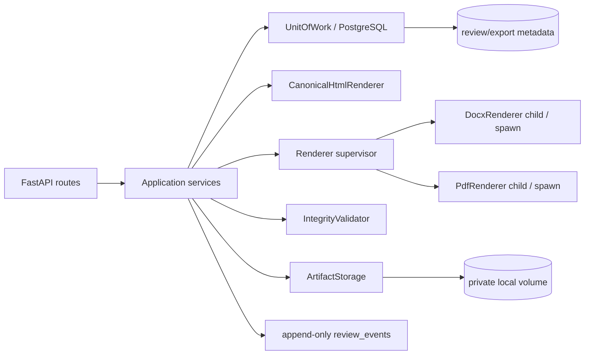
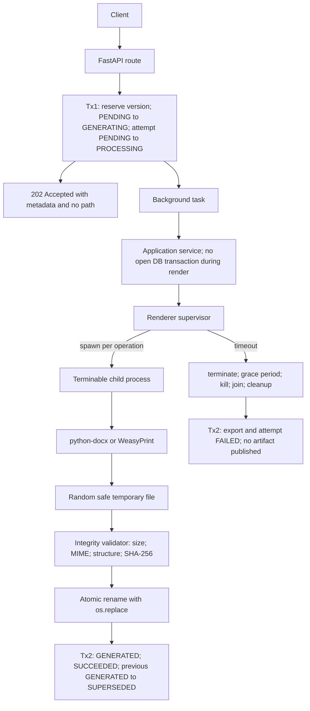

# Plan técnico: Incremento 004 — Revisión humana y exportación

**Branch:** `004-document-review-and-export`
**Fecha:** 2026-08-03
**Especificación:** [spec.md](./spec.md)
**Checklist:** [checklists/requirements.md](./checklists/requirements.md)
**Estado del plan:** A10 integrado; planificación cerrada
**Regla de esta entrega:** el plan no implementa código ni crea commit; las
tareas se mantienen en `tasks.md` como artefacto posterior de Spec Kit.

## 1. Resumen

004 agrega el circuito posterior a la generación de 003: revisión humana
versionada, comentarios y eventos append-only, finalización write-once de un
draft aprobado, preview HTML efímero y exportaciones DOCX/PDF persistidas en
un volumen local privado. Los artefactos se generan desde un snapshot final
inmutable, se validan con SHA-256 y validadores estructurales, y se publican
mediante dos transacciones PostgreSQL cortas y un rename atómico del
filesystem.

La implementación conserva la máquina de estados de `DocumentDraft` de 003.
`APPROVED`/`APROBADO` sigue siendo el estado jurídico; la finalización es
metadata de cierre y no un nuevo estado. El procesamiento de exportación usa
`PENDING → GENERATING → GENERATED`, `FAILED` reintentable y
`SUPERSEDED` únicamente después de una regeneración exitosa. No se agregan
Redis, colas durables, scheduler, almacenamiento cloud, LibreOffice,
autenticación ni publicación oficial.

## 2. Contexto técnico verificado

| Área | Convención existente | Aplicación en 004 |
|---|---|---|
| Lenguaje | Python 3.12 (`apps/api/pyproject.toml`) | Mantener Python 3.12 y mypy estricto |
| Web | FastAPI 0.115+ | Routers bajo `/api/v1`, `BackgroundTasks` local solo para iniciar el pipeline |
| Schemas | Pydantic v2 / pydantic-settings | Schemas nuevos estrictos, `extra="forbid"` en requests |
| ORM | SQLAlchemy 2 async + asyncpg | Modelos en `adapters/database/models.py`, repositorios async |
| UoW | `adapters/database/unit_of_work.py` | Agregar repositorios; nunca retener UoW durante rendering |
| DB | PostgreSQL 16 con pgvector en Compose | Alembic revision `004` dependiente de `003` |
| Migraciones | `apps/api/alembic/versions/001..003` | `004_document_review_and_export.py`, downgrade inverso |
| API errors | handlers en `api/exceptions.py`, serializer público de 003 y request ID middleware | Reutilizar/extender exactamente el envelope público de 003 con `request_id` y `timestamp`, sin serializer público separado para 004 |
| Paginación | `schemas/pagination.py` | `page`, `page_size <= 100`, `created_at DESC, id DESC` |
| Tests | pytest, pytest-asyncio, contract/integration/unit | Fakes para renderers; PostgreSQL/volumen en integración |
| Calidad | Ruff y mypy; cobertura mínima 85 % | Correr sobre `src` y `tests` sin tocar los tests de 001–003 salvo agregar regresión |
| Contenedor | `apps/api/Dockerfile` `python:3.12-slim`, usuario `appuser` | Añadir dependencias Pango/WeasyPrint y volumen privado con permisos mínimos |
| Lock | `apps/api/uv.lock` existe localmente pero está ignorado por Git | Actualizar `pyproject.toml` y regenerar/verificar lock en el entorno de build |

### Dependencias nuevas propuestas

1. `python-docx` para `DocxRenderer`. Se fija en el lock en una versión
   compatible con Python 3.12; la documentación de referencia usada en
   investigación es 1.2.x.
2. `weasyprint` para `PdfRenderer`, fijado en el lock en la serie verificada
   para Python 3.12. El Dockerfile instala Pango/HarfBuzz y demás librerías
   nativas requeridas.
3. No se agrega una librería MIME: `hashlib`, `zipfile`, `pathlib` y firmas
   de PDF son suficientes para la allowlist normativa.
4. No se agrega un sanitizer HTML de terceros: el renderer genera HTML a
   partir de un modelo estructurado, escapa texto y emite solo etiquetas
   allowlisted.
5. `argparse`, `asyncio`, `tempfile`, `os.replace` y `shutil` son stdlib para
   CLI, timeouts y storage.

La decisión y sus alternativas están documentadas en
[research.md](./research.md). La instalación nativa del renderer se verifica
en Docker/Linux; Windows conserva el mismo contrato de puertos y usa WSL o
test doubles para no convertir el entorno Windows base en un requisito de
producción.

### Restricciones operativas

- La generación nunca llama Ollama, embeddings, RAG o red externa.
- La API corre como usuario no root y el volumen de exportación es privado.
- No se mantienen transacciones PostgreSQL abiertas durante render/lectura de
  archivos.
- `202` significa que la fila de procesamiento fue aceptada en Tx1; el
  trabajo local puede continuar después de la respuesta.
- Una tarea en proceso puede perderse al reiniciar el contenedor. El estado
  queda auditado y el comando manual de reconciliación detecta la incidencia;
  004 no inventa recuperación automática.

## 3. Gates de constitución y principios

| Gate | Aplicación verificable |
|---|---|
| Seguridad y privacidad | límites de payload, timeout por renderer, actor/path allowlists, volumen privado, errores sin secretos, logs sin documento/prompt/binario |
| Asistencia, no decisión autónoma | solo una persona puede aprobar la revisión; el export no cambia el estado jurídico ni firma/publica |
| Trazabilidad | `request_id`, actor, versión, hash, renderer, attempt, transiciones y eventos append-only |
| Salida estructurada | `final_snapshot` versionado; canonical document separado de HTML/DOCX/PDF; datos institucionales obligatorios validados |
| Arquitectura modular | dominio → puertos → servicios → adaptadores; renderer y storage reemplazables |
| Stack base | Python/FastAPI/Pydantic/PostgreSQL/Alembic/Docker Compose existentes |
| Desarrollo local reproducible | `.env.example`, Compose, migración, root local y quickstart |
| Calidad y pruebas | mypy estricto, Ruff, unit/integration/contract, migración y smoke Docker |
| Observabilidad | logs estructurados con IDs, estados, tamaños, hashes y duración; health/readiness de storage/renderers |
| Versionado | `draft_version`, `review.version`, `export_version`, snapshot hash y `renderer_version` persistidos |
| Simplicidad | tres tablas de export/revisión exigidas por el dominio, tres puertos de rendering/entrega, sin microservicio/cola/scheduler |

**Desviación explícita:** los principios de infraestructura mencionan Redis
como parte del stack base, pero la especificación de 004 prohíbe colas y Redis.
Se mantiene PostgreSQL como fuente de verdad y se usa una tarea efímera local
solo para cumplir el `202`; la ausencia de cola durable es una decisión de
alcance aprobada, no una deuda silenciosa.

## 4. Arquitectura de ejecución



### Fases de una exportación



El supervisor siempre ejecuta un hijo terminable creado con `spawn`. El
temporal no se publica antes de validar y renombrar atómicamente; un timeout
termina y une el hijo, limpia el temporal, no publica artefactos y no deja
procesos zombis. No existe una transacción PostgreSQL abierta durante render.

`BackgroundTasks` no es una cola durable: solo desacopla la respuesta HTTP de
la operación de rendering dentro del mismo proceso. El servicio se diseña
como función explícita para poder ejecutarlo directamente en tests y en una
futura cola sin cambiar el contrato.

## 5. Estructura exacta de archivos

### Archivos nuevos de dominio y puertos

```text
apps/api/src/legal_ai/domain/
├── canonical_document.py
├── document_export.py
├── errors.py
├── export_attempt.py
├── review.py
├── review_comment.py
└── review_event.py

apps/api/src/legal_ai/ports/
├── artifact_integrity.py
├── artifact_storage.py
├── document_export_repository.py
├── export_attempt_repository.py
├── renderers.py
├── review_comment_repository.py
├── review_event_repository.py
└── review_repository.py
```

`domain/enums.py` y `domain/draft.py` se modifican solo para extender tipos y
metadata de finalización; no se elimina ni cambia ningún estado de 003.

### Servicios y adaptadores nuevos

```text
apps/api/src/legal_ai/application/
├── artifact_integrity.py
├── canonical_document.py
├── export_service.py
├── finalization_service.py
├── reconcile_service.py
├── review_service.py
└── preview_service.py

apps/api/src/legal_ai/adapters/database/
├── document_export_repository.py
├── export_attempt_repository.py
├── review_comment_repository.py
├── review_event_repository.py
└── review_repository.py

apps/api/src/legal_ai/adapters/renderers/
├── __init__.py
├── canonical_html_renderer.py
├── docx_renderer.py
└── pdf_renderer.py

apps/api/src/legal_ai/adapters/storage/
├── __init__.py
└── local_artifact_storage.py
```

Los protocolos viven en `ports/`; los servicios no importan FastAPI,
SQLAlchemy ni WeasyPrint. `application/artifact_integrity.py` contiene
validadores puros; storage solo resuelve/escribe/lee; los renderers no cambian
estado de DB.

### API, configuración y CLI

```text
apps/api/src/legal_ai/api/
├── dependencies.py                         # nuevo: UoW/config/headers 004
├── routes/
│   ├── exports.py                           # nuevo: exports, download, retry, regenerate, attempts
│   └── reviews.py                           # nuevo: revisión/comentarios/historia
└── schemas/
    ├── export.py                            # nuevo
    ├── finalization.py                      # nuevo
    └── review.py                            # nuevo

apps/api/src/legal_ai/cli.py                # nuevo entry point document-exports
```

Se modifican `routes/drafts.py` para finalize/preview,
`api/router.py`, `api/exceptions.py`, `main.py`, `config.py`,
`schemas/draft.py`, `schemas/errors.py` y `adapters/database/unit_of_work.py`.

### Persistencia, contenedor y documentación

```text
apps/api/src/legal_ai/adapters/database/models.py                 # modificar
apps/api/alembic/versions/004_document_review_and_export.py       # nuevo
apps/api/pyproject.toml                                           # modificar deps/entry point
apps/api/Dockerfile                                                # modificar Pango/root
compose.yaml                                                       # modificar volume/env
.env.example                                                       # modificar variables
README.md                                                          # crear/actualizar guía del incremento
```

Los artefactos de planificación son `research.md`, `data-model.md`,
`quickstart.md` y `contracts/*.md`; la lista ejecutable se mantiene separada en
`tasks.md`.

### Tests y fixtures

```text
apps/api/tests/unit/
├── test_actor_validation.py
├── test_artifact_integrity.py
├── test_canonical_document.py
├── test_export_idempotency.py
├── test_export_service.py
├── test_finalization_service.py
├── test_local_artifact_storage.py
├── test_reconcile_service.py
├── test_review_service.py
├── test_review_state_machine.py
└── test_renderers.py

apps/api/tests/integration/
├── factories_004.py
├── test_004_migrations.py
├── test_004_uow_transactions.py
├── test_export_repositories.py
├── test_export_pipeline.py
├── test_review_repositories.py
├── test_storage_integration.py
└── test_renderer_integration.py

apps/api/tests/contract/
├── test_004_error_response.py
├── test_exports_endpoints.py
├── test_finalization_preview_endpoints.py
├── test_reviews_endpoints.py
└── test_download_endpoints.py

apps/api/tests/fixtures/
├── canonical_document.json
├── benchmark_004_dataset.json
├── valid_document.docx
├── valid_document.pdf
├── corrupt_document.pdf
└── zip_bomb_metadata.json

apps/api/scripts/
└── benchmark_004.py

apps/api/tests/benchmark/
└── test_benchmark_004.py
```

Los binarios de fixture son mínimos, sintéticos y no contienen datos
personales. Los tests de renderer pueden generarlos en un `tmp_path` para no
versionar binarios; si se conserva un fixture, se valida su hash.

### Archivos que no deben tocarse

- `specs/001-*`, `specs/002-*` y todos los artefactos de 003.
- `.specify/memory/constitution.md` y `.specify/memory/principles.md`.
- `apps/api/alembic/versions/001_*.py`, `002_*.py`, `003_*.py`.
- Contratos de empleados, expedientes, health y generación de 001–003.
- No crear módulos de autenticación, colas, Redis, scheduler, cloud storage,
  frontend, firma digital, publicación u OCR.

Los archivos de código compartido enumerados como modificables solo reciben
extensiones compatibles y deben cubrirse con los tests de regresión existentes.

## 6. Modelo de dominio y responsabilidades

La definición de campos SQL, checks, índices y relaciones está en
[data-model.md](./data-model.md). Esta sección fija las responsabilidades que
las tareas deben respetar.

### `DocumentDraft`

Mantiene los campos de 003 y expone metadata de finalización. Su método de
dominio `can_finalize()` exige estado aprobado y metadata ausente; su método
`is_finalized()` es verdadero si `finalized_at` está presente. El dominio no
conoce `AsyncSession` ni rutas.

### `DocumentReview`

Representa una revisión para un único `(draft_id, draft_version)`. Al abrirse
persiste `review_snapshot` y `review_snapshot_sha256` mediante JSON canónico;
ambos son write-once y todos los anchors/transiciones se validan contra esa
copia. Controla la
máquina `OPEN → SUBMITTED → APPROVED → CLOSED` y
`SUBMITTED → CHANGES_REQUESTED`; la aprobación registra la decisión
`APPROVED` y persiste el cierre en la misma transacción. Las transiciones son
explícitas, optimistas y auditadas. Una versión nueva del draft no reutiliza la
revisión previa.

### `ReviewComment`

Representa comentario general/anclado o respuesta. El cuerpo y anclaje son
inmutables; el status cambia de `OPEN` a `RESOLVED`/`DISMISSED` con
`expected_version`. El dominio valida que el anclaje pertenezca a la misma
versión y que una respuesta apunte a la misma revisión.

### `ReviewEvent`

Registro append-only de transiciones, comentarios, aprobación, finalización,
exportación, descarga bloqueada e incidencias de reconciliación. Contiene
actor, recurso, versión, timestamp UTC, request/run ID y resumen minimizado.

Los actores de 004 son strings textuales validados de 1–100 caracteres:
`finalized_by`, `exported_by` y los nombres heredados reales de review
(`opened_by`, `submitted_by`, `decided_by`, `author` o `actor`, según la
entidad). No tienen FK ni unicidad, no representan autenticación/autorización,
no aparecen en paths o `file_name`, y `request_id` conserva únicamente
trazabilidad técnica. No se introduce un identificador alternativo de actor.

### `DocumentExport`

Es el metadata del artefacto versionado. Su contador se llama `export_version`,
es independiente de `draft_version` y no contiene el binario ni el snapshot
completo. Es inmutable como contenido: el pipeline solo puede mover estados
permitidos, llenar hash/path tras el rename y escribir error sanitizado.

### `ExportAttempt`

Es el historial de cada procesamiento. La creación inicial y cada retry tienen
fila propia. Un retry de `FAILED` comparte `export_id`, `idempotency_key` y
`request_hash`, incrementa `attempt_number` y no modifica las filas históricas.

### `CanonicalDocument`

Modelo puro y versionado que contiene título, encabezado, VISTO,
CONSIDERANDO, POR ELLO, artículos, firmas y locale. `CanonicalDocumentBuilder`
extrae solo información presente en el snapshot aprobado; la falta de datos
requeridos es un error de validación, no una oportunidad para inventar texto.

## 7. Migración Alembic 004

**Archivo:** `apps/api/alembic/versions/004_document_review_and_export.py`
**Revision:** `004`
**Down revision:** `003`
**No se modifica la revisión 003.**

### Upgrade

1. Alterar `document_drafts` agregando los cinco campos de finalización,
   todos nulos para datos existentes. Añadir checks de coherencia/hash/
   longitudes sin requerir backfill.
2. Crear `document_exports` con `review_id NOT NULL`, pero diferir la FK a
   `document_reviews` hasta que exista esa tabla; así se respeta el orden
   contractual de las tablas de exportación sin perder la relación obligatoria.
3. Crear `export_attempts` con FK obligatoria a `document_exports`.
4. Crear `document_reviews` y `review_comments`, que son las tablas de
   revisión requeridas por los endpoints de 004.
5. Crear `review_operation_requests` para scope, hash y replay de mutaciones
   de review.
6. Crear `review_events`, después de todas sus tablas referenciadas; así el
   mismo evento puede apuntar a una revisión, exportación o attempt.
7. Añadir la FK diferida `document_exports.review_id`, checks, índices normales
   e índices únicos parciales. La secuencia de exportación queda estrictamente
   `document_drafts → document_exports → export_attempts`.

### Columnas y constraints obligatorios

- `document_drafts`: `VARCHAR(100)`, `TIMESTAMPTZ`, `TEXT`, `JSONB`, `CHAR(64)`;
  coherencia de campos, hash hexadecimal, notes con máximo 2.000.
- `document_reviews`: FK a drafts, unique `(draft_id,draft_version)`,
  `review_snapshot`/hash NOT NULL, `version > 0`, status allowlist.
- `review_comments`: FK review/self-parent, status/severity allowlist,
  `version > 0`, índice por review/status/severity.
- `review_events`: FKs opcionales a review/draft/export/attempt, con
  `attempt_id ON DELETE SET NULL` para permitir retención/cleanup de attempts
  fallidos sin borrar auditoría; índice por recurso y `(created_at DESC,id
  DESC)`, índice único parcial para `RECONCILIATION_RUN` por `run_id` no nulo,
  sin UPDATE/DELETE en repositorio.
- `document_exports`: FK draft/review, self-FK parent, unique
  `(draft_id,format,export_version)`, checks de format/status/export_version/filename/hash,
  partial unique `(draft_id,format)` para `PENDING`/`GENERATING`.
- `export_attempts`: FK obligatoria a export, FK draft, unique
  `(export_id,attempt_number)`, checks de format/status/key/hash/número,
  partial unique `(exported_by,idempotency_key)` para `PENDING`/`PROCESSING`.
- `review_operation_requests`: checks de operación/status/key/hash/expiración,
  unique `(operation,resource_id,idempotency_key)` y payload de replay
  sanitizado.

### Defaults y datos existentes

- UUIDs: `gen_random_uuid()` como en 003.
- Timestamps: `now()` con timezone.
- Estados iniciales: `OPEN`, `PENDING` y `PENDING` según tabla.
- No se realiza backfill de drafts ni se crean revisiones/exportaciones para
  datos existentes.
- La migración se ejecuta antes de iniciar la API que expone 004.

### Downgrade

En orden inverso de dependencias: `review_events`, quitar la FK diferida de
`document_exports.review_id`, `review_operation_requests`, `review_comments`,
`document_reviews`, `export_attempts`, `document_exports`, índices/constraints dependientes y
finalmente las cinco columnas de `document_drafts`. El downgrade es destructivo
para datos 004; se documenta backup previo y se prueba en una base de datos
efímera. No se usa `CASCADE` sobre tablas de 001–003.

## 8. Revisión humana

`application/review_service.py` coordina repositorios de review/comment/event
y el repositorio de drafts. Cada mutación sigue:

1. Validar UUID, actor, body, anclaje, `expected_version`,
   `Idempotency-Key` y `request_hash` en Pydantic/domain.
2. Resolver `review_operation_requests` por operación + recurso + clave:
  replay si coincide el hash, `IDEMPOTENCY_CONFLICT` si difiere,
  `REVIEW_OPERATION_IN_PROGRESS` si está `PROCESSING`, y reutilización bajo
  lock si la fila expiró.
3. Leer draft/review y comprobar `(draft_id,draft_version)` contra el
   `review_snapshot` persistido.
4. Ejecutar el UPDATE condicional de review/comment y conservar snapshot/hash
   sin mutarlos.
5. Comprobar comentarios `BLOCKING` abiertos cuando el gate lo requiere.
6. Insertar evento y completar la solicitud de idempotencia en la misma
   transacción.
7. Commit corto; si el rowcount es cero, `CONCURRENT_MODIFICATION`.

La aprobación exige `human_review_confirmed=true`, actor y revisión sin
bloqueos. La transacción registra la decisión `APPROVED`, marca la revisión
cerrada, actualiza el draft a `APROBADO` usando el mecanismo de 003 y agrega
eventos. Solicitar cambios exige motivo, lleva draft a `RECHAZADO` y no borra
comentarios ni eventos. Cuando 003 edita o regenera una nueva versión del draft,
la review abierta de la versión anterior queda marcada como no elegible para
exportación mediante un evento append-only; sus comentarios e historial se
conservan y nunca se reutiliza para la nueva versión.

Una operación después de `finalized_at` se rechaza antes de tocar la fila con
la transición/guardia específica (`DRAFT_ALREADY_FINALIZED` o el error de
mutación heredado), aunque el `expected_version` sea correcto.

## 9. Finalización

### Servicio y transacción

`FinalizationService.finalize(draft_id, expected_version, finalized_by,
finalization_notes, request_id)`:

1. Normaliza el actor con trim y valida la allowlist Unicode; valida notes y
   carga el draft/revisión.
2. Abre una transacción corta y toma `SELECT ... FOR UPDATE` del draft. El
   orden de locks siempre empieza por draft.
3. Si ya finalizó, compara actor/notes/source hash/snapshot de la solicitud
   con el snapshot persistido. Si coincide devuelve replay 200; si difiere,
   `DRAFT_ALREADY_FINALIZED`. Una solicitud que no es replay y usa una versión
   vieja devuelve `CONCURRENT_MODIFICATION`.
4. Exige `APROBADO`, revisión cerrada, `draft_version` igual a
   `expected_version` y cero `BLOCKING` abiertos.
5. Construye la forma canónica, serializa de forma determinista, aplica límite
   de 2 MiB (2.097.152 bytes) y calcula `final_snapshot_sha256`; la validación
   mide bytes UTF-8 y prueba límite exacto, límite + 1 y contenido multibyte.
6. Actualiza solo si `finalized_at IS NULL AND document_drafts.version =
   expected_version`, incrementa `document_drafts.version`, escribe campos y
   crea evento `DRAFT_FINALIZED`.
7. Commit y retorna `FinalizationResponse` con IDs, estado, versión, metadata,
   hash y snapshot final permitido por el contrato.

No se invoca renderer, filesystem ni Ollama en esta transacción. Una
`IntegrityError` de concurrencia se traduce a `CONCURRENT_MODIFICATION`; no se
expone SQL.

## 10. Preview HTML

`PreviewService.preview(draft_id, requested_draft_version)` hace una lectura sin
commit de escritura:

- solo acepta `DraftStatus.APROBADO`;
- antes de finalizar verifica `requested_draft_version == document_drafts.version` y usa el
  contenido aprobado de esa versión;
- después de finalizar también exige `requested_draft_version == document_drafts.version`,
  ignora contenido vivo y usa `final_snapshot`;
- llama a `CanonicalDocumentBuilder` y `CanonicalHtmlRenderer` en memoria;
- escapa texto, bloquea scripts/iframes/URLs remotas y limita el HTML a 5 MiB
  (5.242.880 bytes), medidos como bytes UTF-8;
- calcula SHA-256 del UTF-8 y devuelve ETag;
- no crea fila, intento, archivo, evento ni incremento de versión.

El renderer no recibe una URL ni un path de archivo. La respuesta usa
`text/html; charset=utf-8`, `Cache-Control: no-store`, `ETag` y el header de
request ID; no se define una respuesta condicional 304 para este preview.
Nunca se persiste el body.

## 11. Pipeline de exportación

### Servicios

- `ExportEligibilityService`: verifica draft aprobado/finalizado, review
  cerrada, versión solicitada, snapshot y bloqueos.
- `ExportIdempotencyService`: valida key, calcula hash canónico, busca
  attempts del actor/key dentro de 24 h y resuelve replay/conflicto/activo.
- `ExportService`: orquesta Tx1, tarea de procesamiento, retry, regeneración
  y Tx2; no contiene código de renderer ni path resolution.
- `CanonicalDocumentBuilder`: convierte snapshot a modelo puro.
- `ArtifactIntegrityValidator`: tamaño, extensión, MIME/firma, estructura,
  zip-bomb y SHA.
- `LocalArtifactStorage`: root/path/temp/rename/read/delete/scan.
- `ReviewEventRepository`: registra fases con datos minimizados.

### Tx1 de creación

1. Validar actor y `Idempotency-Key`.
2. Calcular `request_hash` sobre JSON canónico de `{draft_id, draft_version,
   format, exported_by}`; nunca incluir `request_id`.
3. Consultar la ventana de idempotencia. Misma key/hash y resultado existente
   es replay; hash distinto es `IDEMPOTENCY_CONFLICT`; `PROCESSING` es
   `EXPORT_IN_PROGRESS`.
4. Lock corto del draft; verificar que no está finalizado de forma inválida,
   que el snapshot fuente existe y que no hay export activo de ese formato.
5. Asignar `export_version = max(export_version)+1` para el draft/formato.
6. Insertar `document_export=PENDING` y `export_attempt=PENDING` con
   `attempt_number=1`, cambiar en la misma Tx1 a
   `document_export=GENERATING` y `export_attempt=PROCESSING`, y guardar el
   mismo request ID de trazabilidad.
7. Insertar evento `EXPORT_REQUESTED` y commit. No existe una Tx intermedia
   para marcar `GENERATING`/`PROCESSING`.

La ruta devuelve `202` inmediatamente con metadata del export en
`GENERATING` y del attempt en `PROCESSING`, sin path. Un fallo posterior se
consulta mediante `GET` metadata/attempts y no cambia la respuesta inicial.

### Procesamiento fuera de PostgreSQL

1. Leer `final_snapshot` por ID; crear el HTML canónico en memoria con límite
   5 MiB (5.242.880 bytes).
2. Crear un temporal aleatorio en el mismo directorio destino. La ruta de
   destino se construye solo con UUIDs/formato/export_version/nombre determinista.
3. Ejecutar el renderer correspondiente en un proceso hijo aislado y
   terminable, creado con `multiprocessing.get_context("spawn")`. El hijo
   recibe únicamente el documento/HTML serializable, opciones serializables y
   la ruta temporal segura; nunca recibe sesiones DB, objetos ORM, request
   context ni `storage_path` público. Aplicar timeout de 30/60 s y escribir
   únicamente al temporal. El renderer no decide el destino final.
4. Validar tamaño, extensión, MIME, estructura y SHA-256. Un error elimina el
   temporal y produce error sanitizado.
5. Publicar con `os.replace`/rename atómico solo en el mismo filesystem.

### Tx2 de éxito

1. Lock del draft y del nuevo export en el mismo orden que Tx1.
2. Confirmar que el temporal ya está en destino y que el hash calculado es el
   que se va a persistir.
3. Marcar nuevo export `GENERATED`, attempt `SUCCEEDED`, timestamps,
   `storage_path`, hash y renderer metadata.
4. En regeneración, marcar solo el export `GENERATED` vigente anterior como
   `SUPERSEDED`; una fuente ya `SUPERSEDED` conserva ese estado.
5. Crear eventos `EXPORT_GENERATED` y `EXPORT_SUPERSEDED` cuando corresponda.
6. Commit corto.

### Fallos y compensación

- Renderer/validación: eliminar temporal y usar Tx2 para marcar export y
  attempt `FAILED`, conservando error code/message sanitizado.
- Timeout del hijo: solicitar terminación, esperar una gracia breve, forzar
  `kill` si sigue activo, ejecutar `join`, eliminar temporales y registrar
  `GENERATION_TIMEOUT`. El proceso no se reutiliza, no deja zombis y nunca se
  publica un artefacto vencido. Este ciclo no mantiene una transacción DB
  abierta.
- Rename fallido: no hay artefacto descargable; registrar `FILESYSTEM_ERROR`.
- Tx2 no confirmable después de rename: intentar `unlink` del definitivo, no
  abrir una tercera transacción y dejar el registro activo/incompleto para
  reconciliación manual. Si Tx2 sí confirma el fallo de pipeline, el export y
  attempt quedan `FAILED`.
- Nunca se marca `GENERATED` sin confirmación DB.
- Si la compensación de filesystem falla, el reconciliador detecta archivo
  huérfano; no se borra el último `GENERATED` válido.

## 12. Renderers

### Protocolos

En `ports/renderers.py`:

```python
class CanonicalHtmlRenderer(Protocol):
    name: str
    renderer_version: str
    def render(self, document: CanonicalDocument) -> str: ...

class DocxRenderer(Protocol):
    name: str
    renderer_version: str
    def render(self, document: CanonicalDocument, output_path: Path) -> RenderResult: ...

class PdfRenderer(Protocol):
    name: str
    renderer_version: str
    @staticmethod
    def health() -> bool: ...
    def render(self, html: str, output_path: Path) -> RenderResult: ...
```

Las excepciones de renderer posteriores al `202` se convierten en estado
`FAILED` y códigos/mensajes sanitizados persistidos en export/attempt; no se
transforman en una respuesta HTTP tardía. `EXPORT_GENERATION_FAILED` (500),
`GENERATION_TIMEOUT` (504), `MIME_VALIDATION_FAILED` o `VALIDATION_ERROR` solo
son respuestas síncronas si el fallo ocurre antes de aceptar/programar. Los
renderers no escriben DB, no calculan el SHA persistido, no
eliminan archivos finales y no reciben `storage_path` desde el cliente.

### DOCX

`DocxRenderer` configura y valida:

- A4 vertical;
- márgenes superior/inferior 2,5 cm, izquierdo 3 cm, derecho 2 cm;
- estilo de cuerpo Arial 11;
- título Arial 12, negrita, centrado;
- texto justificado, interlineado 1,5 y 6 pt posterior;
- encabezado institucional configurable;
- VISTO, CONSIDERANDO y POR ELLO;
- artículos `ARTÍCULO N°` con numeración determinista;
- espacios de firma configurables;
- sin pie salvo número de página;
- locale `es-AR`;
- metadata del paquete sin autor/propiedades personales innecesarias.

Antes de guardar valida campos requeridos del `CanonicalDocument`. Después,
`ArtifactIntegrityValidator` abre el ZIP y comprueba `[Content_Types].xml`,
`word/document.xml`, máximo 500 entries, máximo 50 MiB (52.428.800 bytes)
descomprimidos y ratio máximo 100:1. El archivo final no puede exceder 20 MiB
(20.971.520 bytes).

### PDF

`PdfRenderer` recibe el HTML canónico exactamente producido para preview,
configura CSS de impresión A4/locale y usa WeasyPrint con `url_fetcher` que
rechaza toda red y archivo externo. No convierte DOCX. El PDF final no puede
exceder 30 MiB (31.457.280 bytes) y se valida por MIME `application/pdf`, header `%PDF-` y
`%%EOF` dentro del tramo final.

### Timeouts y test doubles

El servicio impone deadlines de 30/60 s y ejecuta cada DOCX/PDF en un proceso
hijo independiente creado con contexto `spawn`. El ejecutor pasa solo datos
serializables y la ruta temporal segura. Al vencer el deadline solicita
terminación, espera una gracia breve, fuerza `kill` si es necesario, ejecuta
`join`, elimina temporales, registra `GENERATION_TIMEOUT` y descarta el
resultado; no reutiliza el proceso ni deja una transacción DB abierta. No se
publica ningún artefacto producido después del timeout y se evita dejar hijos
zombis. `asyncio.wait_for` o una cancelación cooperativa pueden complementar
el flujo, pero no sustituyen la terminación del proceso hijo frente a librerías
bloqueantes. Los tests usan `FakeCanonicalHtmlRenderer`, `FakeDocxRenderer` y
`FakePdfRenderer` para éxito, error, salida vacía, timeout, terminación,
`kill`/`join`, cleanup y ausencia de publicación. La integración WeasyPrint es
un smoke opcional dentro de Docker/Linux.

## 13. Storage local

### Puerto

`ports/artifact_storage.py` define `resolve`, `create_temp`, `atomic_publish`,
`open_stream`, `stat`, `delete`, `scan` y `health`. Ningún método devuelve el
root real a la API.

### Layout

```text
{case_file_id}/{draft_id}/{format}/v{export_version}/{file_name}
```

`file_name` es exactamente `{draft_id}_v{export_version}.{extension}`, en minúsculas.
El path se persiste solo como relativo y tiene máximo 500 caracteres. No se
incluyen case number, document type, fechas, actores o nombres personales.

### Seguridad de paths

1. Rechazar paths absolutos, `..`, separadores inesperados, doble extensión y
   extensiones fuera de DOCX/PDF.
2. Resolver el root canónico configurado; verificar que cada segmento ya
   existente no es symlink mediante `lstat` y que el resultado permanece bajo
   el root.
3. Crear directorios uno por uno con mode 0700 y revalidar cada segmento.
4. Crear temporal aleatorio en el mismo directorio, mode 0600, sin usar un
   nombre enviado por el cliente.
5. `flush`/`fsync` cuando el adaptador lo permita y `os.replace` para publicar.
6. En la ruta de descarga, rechazar un header `Range` antes de abrir el archivo
   o iniciar validación/streaming, con `416 Range Not Satisfiable`,
   `RANGE_NOT_SUPPORTED`, envelope JSON con `request_id`, `timestamp` y
   `Accept-Ranges: none`; no devolver `Content-Range` ni leer el archivo
   completo. Para una descarga válida, repetir resolución/symlink check antes
   de abrir y no admitir Range.

Windows conserva validaciones de path/symlink y usa permisos best-effort;
Linux/containers son el entorno normativo para 0700/0600.

## 14. Integridad y descarga

`application/artifact_integrity.py` expone validadores puros:

- `validate_size(path, format)` con límites DOCX/PDF;
- `validate_docx(path)` con ZIP, required entries, entries/ratio/uncompressed;
- `validate_pdf(path)` con extensión, firma y EOF final;
- `calculate_sha256(path)` en streaming;
- `expected_mime(format)` allowlist;
- `validate_download(export, path)` que combina path, MIME, estructura y hash.

En creación se rechaza archivo vacío, tamaño excedido, MIME/firma incorrecta,
  estructura inválida, ZIP bomb, extensión/doble extensión inválida o hash
  inconsistente. En descarga se recalcula SHA-256 antes de abrir el stream; la
  corrupción registra un evento append-only de integridad bloqueada y siempre
  usa el código HTTP estable `EXPORT_FILE_CORRUPTED` (409), sin competir con
  códigos de causa internos, y no cambia el status DB. La regeneración es
  explícita.

`GET /download` obtiene metadatos, valida primero y recién después devuelve
`StreamingResponse` con chunks, Content-Length, Content-Type,
Content-Disposition, ETag y Cache-Control. Si se detecta un problema no se
inicia el stream.

## 15. Retry y regeneración

### Retry

`POST /exports/{id}/retry` solo acepta `FAILED`. El servicio carga el último
attempt, exige la misma key/hash y actor, verifica que no haya intento activo,
calcula `attempt_number + 1` y crea solo una nueva fila `export_attempts`.
En la misma Tx1 pasa el export a `GENERATING` y el nuevo attempt a
`PROCESSING`; no existe una Tx intermedia. Los attempts previos siguen
`FAILED`, el snapshot fuente y formato no cambian.

La creación inicial, si encuentra el export `FAILED`, devuelve sus metadatos y
no crea otro attempt. En retry, cada invocación posterior a un fallo crea otro
attempt; un attempt activo devuelve `EXPORT_IN_PROGRESS`, un retry exitoso
repite `200`, y un payload distinto devuelve `IDEMPOTENCY_CONFLICT`. El retry
no requiere `expected_version` porque no modifica el draft ni asigna una
`export_version`.

### Regeneración

`POST /exports/{id}/regenerate`:

1. Carga origen `GENERATED`/`SUPERSEDED`; no abre ni valida su archivo para
   decidir si se puede regenerar.
2. Lock del draft, consulta `max(export.export_version)` del formato y compara con
   `expected_version`.
3. Comprueba que no haya `PENDING`/`GENERATING` para el draft/formato.
4. Inserta nuevo `export_version = max(export_version)+1`,
   `parent_export_id=source.id`, mismo
   `review_id`, snapshot SHA nuevo (igual al snapshot fuente si el contenido no
   cambió), nuevo path determinista y attempt 1.
5. Procesa desde `final_snapshot` únicamente.
6. Tx2 marca nuevo `GENERATED` y solo después el export `GENERATED` vigente
   anterior `SUPERSEDED`.

Si falla, el origen conserva status, hash, path y descargabilidad. La misma
key/hash devuelve replay 200; otro payload devuelve conflicto. No hay
regeneración directa desde `FAILED`; se usa retry.

## 16. Listados y metadata

Los repositorios implementan filtros parametrizados y orden estable:

- exports por draft: `draft_version`, `export_version`, `format`, `status`, `page`, `page_size`;
- attempts por export: `status`, `page`, `page_size`;
- history de review: `page`, `page_size`;
- get individual por UUID.

`DocumentExportResponse` expone id, `draft_id`, `draft_version`, review id y `export_version`,
parent id, formato, estado, hashes, renderer, actor, timestamps, error code y
mensaje seguro. `ExportAttemptResponse` expone id, export id, estado, número,
key/hash, actor, request ID, timestamps y error seguro. Ningún schema tiene
campo `storage_path`, path absoluto, snapshot o binario.

## 17. Concurrencia e idempotencia

### Orden de locks

1. `document_drafts` por `draft_id`.
2. `document_exports` por `export_id`/fila nueva cuando exista.
3. `export_attempts` por key/row cuando exista.

Nunca se toma el lock de export antes que el de draft. Los queries `MAX(export_version)`
y la inserción ocurren bajo el lock del draft. Los índices parciales protegen
contra dos escritores que lleguen a la misma ventana; un `IntegrityError` se
traduce a `EXPORT_IN_PROGRESS`, `ACTIVE_GENERATION_EXISTS` o
`IDEMPOTENCY_CONFLICT` según la consulta posterior.

### Expected version

- Finalización: `document_drafts.version`.
- Revisión/comentario: `document_reviews.version` o
  `review_comments.version` según recurso.
- Regeneración: máximo `document_exports.export_version` del draft/formato.
- Retry: no aplica; el export y attempt son las entidades versionadas por el
  nuevo intento.

### Idempotency hash

JSON canónico, UTF-8, `sort_keys=True`, separadores compactos. Para review
incluye la operación dentro del scope, el recurso y el body normalizado. Para
la creación de export incluye `{draft_id, draft_version, format, exported_by}`;
retry valida actor y payload contra esa solicitud inicial y reutiliza exactamente
su `request_hash`, sin incorporar el endpoint `/retry`. Para regeneración
incluye `{source_export_id, expected_version, format, exported_by}`. Se
excluyen `request_id`, timestamp de recepción y headers no funcionales. La
ventana de 24 horas controla replay; las filas históricas no se borran al
expirar.

## 18. Reconciliación y compensación

`application/reconcile_service.py` implementa exactamente el contrato de
[admin-reconcile-cli.md](./contracts/admin-reconcile-cli.md): dry-run por
defecto, `--execute`, filtros, salida JSON, actor/timestamp/recurso/acción/
resultado y run ID idempotente.

El escaneo compara DB y filesystem sin revelar paths. Cada primera detección de
un archivo huérfano persiste un evento append-only `ORPHAN_DETECTED` con un
fingerprint opaco del identificador relativo; las ejecuciones posteriores usan
el `created_at` de ese evento para calcular los 7 días. Detecta:

- temporales de más de 24 horas;
- archivos sin fila de más de 7 días desde la primera detección persistida;
- exports descargables sin archivo;
- hash/MIME/estructura inválidos;
- filas/attempts en estados incompletos;
- attempts `FAILED` de más de 180 días.

Solo se pueden eliminar temporales, huérfanos elegibles y attempts fallidos
fuera de retención. Nunca se eliminan automáticamente registros sin archivo,
corruptos, el último `GENERATED` válido, el attempt con mayor
`attempt_number` de cada export, metadata de `document_exports` fallida ni un
archivo con attempt `PROCESSING` activo. Un mismo run ID con filtros distintos
es `CLEANUP_CONFLICT`.

## 19. Errores y observabilidad

`domain/errors.py` define excepciones tipadas con código estable, status
esperado y detalles seguros. `api/exceptions.py` agrega el mapping de 004;
`main.py` registra handlers reutilizando o extendiendo el serializer público
de 003, sin crear un serializer público separado para 004. El envelope exacto
es:

```json
{
  "error": {
    "code": "EXPORT_FILE_CORRUPTED",
    "message": "The exported file failed integrity validation.",
    "details": {},
    "request_id": "...",
    "timestamp": "2026-08-03T21:00:00Z"
  }
}
```

`timestamp` es obligatorio, generado por el servidor en UTC, RFC 3339 y con
sufijo `Z`. El handler
de validación convierte Pydantic/domain errors a `VALIDATION_ERROR` y conserva
solo `field`, `code`, `limit` o estado permitido.

Mensajes y detalles nunca incluyen stack trace, SQL, filesystem root,
`storage_path`, prompts, documento, tokens o excepciones de `python-docx`/
WeasyPrint. Los detalles internos quedan en logs estructurados sanitizados.

Campos de log permitidos:

```text
request_id, run_id, draft_id, review_id, export_id, attempt_id,
format, draft_version, export_version, old_status, new_status,
renderer_name, renderer_version, duration_ms, size_bytes,
source_snapshot_sha256, content_sha256, error_code, phase
```

Fases observables: `tx1`, `state_transition`, `render`, `validate`, `rename`,
`tx2`, `compensation`, `download_integrity`, `reconcile`. Se agregan métricas
de latencia, tamaños, estados, timeouts, fallos por renderer, previews y
storage health. No se agrega un sistema de métricas externo en 004.

### Benchmarks informativos A8

Los benchmarks son un comando separado de pytest y no se ejecutan en la suite
unitaria ordinaria ni en el CI estándar. El dataset fijo
`apps/api/tests/fixtures/benchmark_004_dataset.json` se identifica como
`004-benchmark-v1` y contiene 100 drafts/reviews, 1.000 comentarios, un
snapshot canónico de 100 KiB para preview/aceptación, un DOCX y un PDF válidos
de 1 MiB (1.048.576 bytes) para descarga y 1.000 registros/entradas con 100 incidencias para
reconcile dry-run. Todo es sintético y sin PII.

Cada caso ejecuta 10 warm-up y 50 iteraciones medidas, secuenciales, con
`time.perf_counter()`. El p95 usa `ceil(0.95 * N)` sobre muestras ordenadas en
milisegundos. El entorno de referencia es `linux/amd64` en Docker Compose,
Python 3.12, PostgreSQL 16, 4 vCPU, 8 GiB RAM, SSD local, sin Ollama ni red
externa. El resultado registra commit, lockfile, hash del dataset y entorno
real.

El comando documentado es:

```bash
cd apps/api
uv run python scripts/benchmark_004.py \
  --dataset tests/fixtures/benchmark_004_dataset.json \
  --warmup 10 --iterations 50 \
  --output artifacts/benchmarks/004.json
```

| Caso | Medición | Umbral p95 informativo |
|---|---|---:|
| Revisión | `GET /api/v1/drafts/{draft_id}/reviews/current` sin binario | `< 300 ms` |
| Preview | HTML canónico de 100 KiB | `< 2.000 ms` |
| Aceptación 202 | `POST /api/v1/drafts/{draft_id}/exports` hasta recibir `202` | `< 500 ms` |
| Descarga | `GET /api/v1/exports/{export_id}/download`, validación y consumo completo de DOCX/PDF de 1 MiB (1.048.576 bytes) | `< 1.500 ms` |
| Reconcile | `document-exports reconcile` en dry-run | `< 3.000 ms` |

La medición de aceptación usa un scheduler/renderer fake después de Tx1 y no
incluye generación completa DOCX/PDF. El runner escribe muestras, p95,
umbral, baseline opcional (`--baseline`), `regression_alert`, timestamp,
commit, dataset y entorno en JSON. Un umbral excedido o una regresión superior
al 10% del baseline suministrado emite una alerta estructurada sin fallar el
comando; los errores de infraestructura o medición sí son errores del runner.
Convertirlo en gate de release requiere una decisión posterior.

## 20. Configuración

Agregar `ExportConfig` en `config.py`, validado por Pydantic settings:

| Variable | Tipo/default | Uso |
|---|---|---|
| `EXPORT_STORAGE_ROOT` | `Path`, `/var/lib/legal-ai/exports` | root canónico local |
| `DOCX_GENERATION_TIMEOUT_SECONDS` | `int`, 30, `>0` | timeout DOCX |
| `PDF_GENERATION_TIMEOUT_SECONDS` | `int`, 60, `>0` | timeout PDF |
| `MAX_DOCX_SIZE_BYTES` | `int`, 20 MiB (20.971.520 bytes) | límite DOCX |
| `MAX_PDF_SIZE_BYTES` | `int`, 30 MiB (31.457.280 bytes) | límite PDF |
| `MAX_PREVIEW_SIZE_BYTES` | `int`, 5 MiB (5.242.880 bytes) | límite HTML |
| `MAX_FINAL_SNAPSHOT_BYTES` | `int`, 2 MiB (2.097.152 bytes) | snapshot serializado |
| `MAX_EDITABLE_CONTENT_BYTES` | `int`, 2 MiB (2.097.152 bytes) | guardia runtime 004 sin modificar el límite documental histórico de 003 de 100 KiB |
| `MAX_FILE_NAME_LENGTH` | `int`, 120 | nombre determinista |
| `MAX_RELATIVE_PATH_LENGTH` | `int`, 500 | path relativo |
| `MAX_FINALIZATION_NOTES_LENGTH` | `int`, 2.000 | notes |
| `MAX_PAGE_SIZE` | `int`, 100 | listas |
| `EXPORT_IDEMPOTENCY_WINDOW_HOURS` | `int`, 24 | replay |
| `EXPORT_FAILED_ATTEMPT_RETENTION_DAYS` | `int`, 180 | cleanup |
| `EXPORT_TEMP_RETENTION_HOURS` | `int`, 24 | cleanup |
| `EXPORT_ORPHAN_RETENTION_DAYS` | `int`, 7 | cleanup |
| `EXPORT_PDF_EOF_TAIL_BYTES` | `int`, 4096 | validación PDF |

Los valores se documentan en `.env.example`, se inyectan en tests y no se
guardan en logs. Un root no existente se crea en startup/health del adaptador;
un root no escribible produce `EXPORT_STORAGE_UNAVAILABLE`.

## 21. Testing

### Unitarios

- estados de review/comment/export/attempt y transiciones inválidas;
- actor trim/Unicode/longitud/caracteres prohibidos;
- canonical snapshot determinista, tamaño y hash;
- finalización: primer éxito, replay, payload divergente, stale `expected_version`,
  estado no aprobado, bloqueos y mutación posterior;
- preview: snapshot correcto, escape XSS, ETag, límite y cero side effects;
- HTML/DOCX/PDF fakes, timeouts, aislamiento `spawn`, terminación/gracia/
  `kill`/`join` y errores sanitizados;
- DOCX institucional y PDF signature/EOF;
- ZIP bomb: 501 entries, >50 MiB (52.428.800 bytes), ratio >100:1, entries requeridas ausentes;
- path absoluto, `..`, symlink por segmento, doble extensión, permisos y
  atomic rename;
- idempotencia de cada mutación de review y create/retry/regenerate, misma
  key/hash, conflicto, active, expiración, replay y retry history;
- validación de download missing/corrupt/hash/MIME con respuesta pública única
  `EXPORT_FILE_CORRUPTED` y sin cambiar status;
- reconciliación dry-run, execute, último GENERATED, PROCESSING, run replay y
  `CLEANUP_CONFLICT`.

Archivos principales: `test_actor_validation.py`,
`test_review_state_machine.py`, `test_finalization_service.py`,
`test_canonical_document.py`, `test_artifact_integrity.py`,
`test_local_artifact_storage.py`, `test_export_idempotency.py`,
`test_export_service.py`, `test_reconcile_service.py` y `test_renderers.py`.

### Integración PostgreSQL

- upgrade desde `003` y downgrade a `003` en base efímera;
- checks, FKs, unique `(draft,format,export_version)` y partial indexes;
- UoW commit/rollback en Tx1/Tx2 y evento append-only;
- dos solicitudes concurrentes para finalización, versión y generación;
- retries que preservan attempts FAILED;
- regeneración con origen SUPERSEDED y origen sin/corrupto archivo;
- `run_id` persistido y conflictos de filtros.

### API contractual

- los ocho endpoints de review;
- finalize, preview y los siete endpoints de exportación/metadata;
- todos los estados HTTP y catálogo de error;
- request ID en JSON y headers binarios/HTML;
- ausencia de `storage_path`, contenido e internos;
- `If-None-Match`, streaming, rechazo Range `416/RANGE_NOT_SUPPORTED`,
  `Accept-Ranges: none`, ausencia de `Content-Range` y no lectura completa;
- Pydantic con `extra=forbid`, `page_size > 100`, UUID inválido y actor/key
  inválidos.

### Benchmarks

- el runner y su dataset tienen tests específicos fuera de `tests/unit`;
- se verifica el cálculo p95, el JSON de resultados, los cinco umbrales y la
  alerta no bloqueante;
- la aceptación `202` usa fake y no espera ni mide render DOCX/PDF completo;
- el comando no se incluye en los comandos normales de pytest ni CI.

### Filesystem, renderer y Docker

- `tmp_path` aislado por test;
- fake renderers para la suite normal;
- WeasyPrint/python-docx reales solo en integración opcional Linux/Docker;
- inspección del DOCX como ZIP/XML, sin LibreOffice;
- `docker compose config --quiet`, build, volumen writable, health/readiness
  de storage/renderers y smoke de descarga.

La suite 001–003 debe ejecutarse sin modificaciones de sus tests ni cambios
de comportamiento observables.

## 22. Fases de implementación

Cada fase termina en un checkpoint verificable antes de iniciar la siguiente.

| Fase | Dependencias | Entregables | Criterio de finalización |
|---:|---|---|---|
| 1. Base y configuración | 003 | `ExportConfig`, env example, pyproject/Docker/Compose | settings validan, root health y build de dependencias |
| 2. Dominio y migración | 1 | enums, dataclasses, ORM, revision 004 | upgrade/downgrade y constraints pasan |
| 3. Puertos/repositorios/UoW | 2 | repos review/export/attempt/event, UoW | integración CRUD y locks pasan |
| 4. Schemas/errores | 2–3 | requests/responses, errores, envelope público de 003 | contract tests de validación/mapping pasan |
| 5. Revisión humana | 3–4 | service, routes, comments/events | flujos OPEN→CLOSED y cambios solicitados pasan |
| 6. Finalización | 3–5 | canonical snapshot, service, route | primer/replay/stale/mutability tests pasan |
| 7. HTML preview | 6 | canonical HTML, preview route/ETag | HTML seguro/no persistido y límites pasan |
| 8. Storage/integridad | 1–4 | local storage, validators, permissions | traversal/symlink/ZIP/PDF/hash tests pasan |
| 9. Renderers | 7–8 | DOCX, PDF, fakes, health, procesos hijos | requisitos institucionales, aislamiento y timeouts pasan |
| 10. Creación export | 6–9 | Tx1, `BackgroundTasks` local, renderer hijo, Tx2/compensación | 202, GENERATED, FAILED y replay pasan |
| 11. Download/listados | 10 | metadata, streaming, ETag, pagination | download validado y schemas sin path pasan |
| 12. Retry/regenerate | 10–11 | attempts, parent/export_version/superseded | retry history y fallo aislado pasan |
| 13. Reconcile/observabilidad | 8,10–12 | CLI, audit, logs/health | dry-run/execute/run-id y códigos de salida pasan |
| 14. Benchmarks informativos | 5–13 | dataset, runner, JSON y alertas | cinco benchmarks reproducibles sin gate bloqueante |
| 15. Documentación final | 14 | README, quickstart, dependencias nativas y protocolo de benchmarks | documentación coincide con implementación y decisiones cerradas |
| 16. Validación final | todas | Ruff, mypy, suite/cobertura, migración, Docker y diff | smoke previsualiza HTML y crea/descarga DOCX y PDF; Range `416/RANGE_NOT_SUPPORTED` verificado; `READY_FOR_TASKS` |

Las tareas de `tasks.md` siguen este orden; esta sección no duplica el detalle
ejecutable de cada tarea.

## 23. Complejidad justificada

| Complejidad | Justificación y límite |
|---|---|
| Tres tablas de revisión | requisitos de versión, comentarios y auditoría append-only |
| `document_exports` + `export_attempts` | separa artefacto válido de cada fallo/retry y habilita idempotencia auditable |
| `CanonicalDocument` | la constitución exige salida estructurada separada de renderers |
| Tres renderer ports | HTML preview/intermedio, DOCX y PDF tienen contratos y validaciones distintas; cada adaptador es reemplazable |
| `ArtifactStorage` | evita path traversal y permite cambiar volumen local sin tocar servicios |
| Dos transacciones y compensación | requisito explícito para no mantener DB durante rendering y coordinar DB/filesystem sin transacción distribuida |
| Índices parciales | prevención DB de generación/attempt activo duplicado bajo carrera |
| `BackgroundTasks` local | satisface respuesta 202 sin Redis/cola; no se convierte en job durable |
| CLI `argparse` | cleanup manual auditable sin scheduler ni dependencia CLI adicional |
| `review_events` como audit general | evita una tabla de jobs/run IDs; conserva eventos de revisión/export/reconcile en un único append-only |
| `python-docx`/WeasyPrint | únicos binarios/librerías necesarios para DOCX directo y PDF desde HTML; se aíslan detrás de puertos |
| Procesos hijos de renderer | el aislamiento `spawn` por operación permite terminar librerías bloqueantes sin mantener DB abierta ni publicar resultados vencidos; se limita a un ejecutor pequeño y testeable |
| Runner de benchmarks | un script stdlib con dataset fijo permite medir A8 sin agregar pytest-benchmark ni convertir métricas informativas en un gate |

No se agregan microservicios, Redis, colas, almacenamiento cloud, conversiones
DOCX→PDF, autenticación, firma o frontend. Cada abstracción tiene un test
double y una responsabilidad única.

## 24. Riesgos y mitigaciones

| Riesgo | Mitigación |
|---|---|
| WeasyPrint/Pango no disponible en Windows | runtime normativo Linux/Docker, health check, WSL/test double y puerto reemplazable |
| renderer bloqueado o hijo zombi | proceso hijo `spawn` por operación, terminación→gracia→`kill`→`join`, timeout probado y cleanup del temporal |
| tarea local perdida al reiniciar | estados GENERATING/PROCESSING auditados y reconcile manual; nunca se publica sin Tx2 |
| draft actual libre no estructurado | builder determinista, no inventa campos y renderer devuelve validación clara |
| discrepancia envelope legacy/normativo | reutilizar/extender el serializer público de 003 con `timestamp`/`request_id` y pruebas contractuales de no-regresión, sin serializer público separado para 004 |
| carrera de versión/active | lock draft, índices parciales, `IntegrityError` traducido y transacciones cortas |
| ZIP bomb o MIME spoofing | límites estructurales, firma, required entries, ratio y hash en creación/descarga |
| cleanup elimina un artefacto válido | reglas de último GENERATED/PROCESSING, dry-run y `--execute` explícito |
| metadata sensible en logs | logger whitelisting y pruebas de no exposición |
| variabilidad de benchmarks | entorno Docker fijado, dataset/hash registrados, warm-up/iteraciones/p95 explícitos y resultados informativos |

## 25. Validación final del plan

Antes de generar `tasks.md`, el implementador debe comprobar:

1. `spec.md` y `requirements.md` siguen siendo la fuente funcional y no se
   cambian decisiones cerradas.
2. El modelo y la migración no modifican 001–003 ni la constitución/principios.
3. Las rutas de código propuestas coinciden con la estructura inspeccionada.
4. La secuencia de migración y downgrade, los estados, hashes, límites,
   storage, retry, regeneración y cleanup son consistentes con el contrato.
5. El comando de benchmarks A8 produce JSON reproducible y sus umbrales son
  informativos; no se ejecuta en el CI estándar ni mide generación completa
  dentro de la latencia `202`.
6. Los renderers DOCX/PDF usan procesos hijos `spawn` terminables por
   operación; el timeout ejecuta terminación, gracia, `kill`, `join`, cleanup y
   `GENERATION_TIMEOUT` sin publicar el artefacto.
7. La descarga rechaza Range con `416 RANGE_NOT_SUPPORTED`, envelope JSON con
   `request_id`, `timestamp` y `Accept-Ranges: none`, sin streaming, lectura completa ni
   `Content-Range`.
8. `git diff --check` no reporta whitespace.
9. No se implementó código ni se creó commit en esta fase de planificación;
   `tasks.md` se mantiene como artefacto separado.

**Veredicto del plan:** `READY_FOR_TASKS`.
