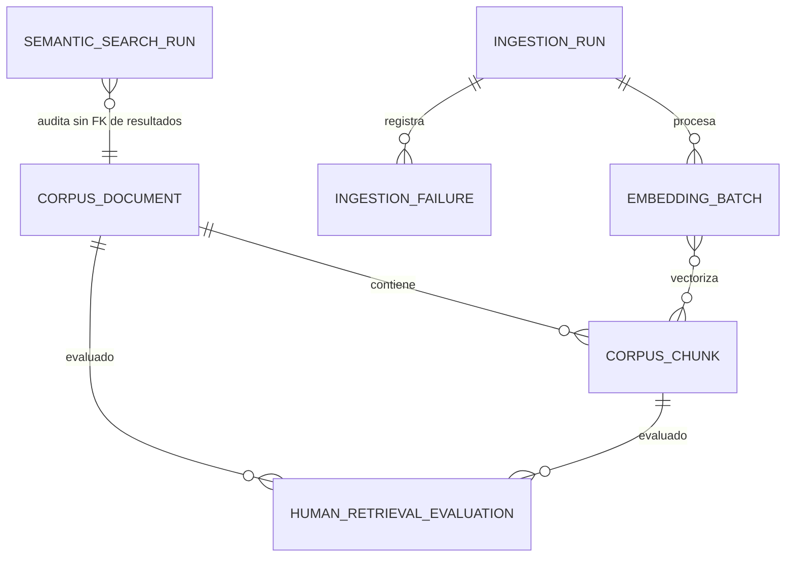

# Modelo de datos: Incremento 005

**Status**: `IMPLEMENTATION_EXTERNAL_GATE_PENDING`

## Convenciones

- UUID, timestamps UTC con zona, enums/check constraints explícitos.
- Hashes SHA-256 como 64 caracteres hex lowercase.
- `embedding vector(1024)` es el contrato confirmado para la migración 005.
- JSONB contiene metadata secundaria sanitizada; filtros principales son columnas.
- Filas con vector nulo solo son válidas mientras el chunk está en staging/falla.

## `corpus_documents`

| Campo | Tipo | Nulable | Regla |
|---|---|---:|---|
| id | UUID | No | PK |
| external_id | texto | No MVP | Único por source_name |
| title | texto | Sí | Límite contractual |
| document_type | enum | No | `decreto` MVP |
| document_subtype | enum | No | `designacion_transitoria` MVP |
| jurisdiction | enum | No | `nacion` MVP |
| language | enum | No | `es` MVP |
| organization / authority | texto | Sí | Normalizado |
| source_name | texto | No | Fuente contractual |
| source_url | texto | Sí | HTTPS válido, no se consulta |
| source_identifier | texto | No | Identificador sanitizado; nunca path absoluto |
| publication_date | fecha | Sí | Fecha civil |
| raw_content | texto | No | Original protegido en PostgreSQL; nunca API/logs |
| raw_content_hash | char(64) | No | SHA-256 original |
| normalized_content_hash | char(64) | No | Indexado |
| normalized_content | texto | No | Límite por archivo |
| metadata | JSONB | No | Objeto sanitizado |
| provenance_type | enum | No | `AUTOMATED`/`HUMAN_REVIEWED` |
| review_status | enum | No | `PENDING_REVIEW`/`REVIEWED`/`REJECTED` |
| review_version | integer | No | Default 1; entero positivo; CAS de revisión |
| reviewed_by | texto | Sí | Nulo solo en PENDING; obligatorio al aprobar/rechazar |
| reviewed_at | timestamptz | Sí | Obligatorio cuando deja PENDING_REVIEW |
| review_notes | texto | Sí | Acotado y sanitizado; motivo requerido al rechazar |
| created_by_pipeline_version | texto | No | Pipeline que creó la fila |
| normalization_version | texto | No | Inmutable por generación |
| chunking_version | texto | No | Versión efectiva |
| ingestion_status | enum | No | Estado pipeline |
| embedding_status | enum | No | Estado vectorial |
| active_generation | entero | Sí | Generación consultable |
| created_at / updated_at | timestamptz | No | UTC |

Índices: `uq_corpus_documents_source_external` es unique parcial sobre
`(source_name, external_id) WHERE ingestion_status <> 'FAILED'`: impide dos
identidades vigentes y permite conservar/reintentar filas históricas fallidas.
`uq_corpus_documents_identity_active` es unique parcial sobre
`(source_identifier, raw_content_hash, normalized_content_hash) WHERE
active_generation IS NOT NULL AND ingestion_status <> 'FAILED'`: solo una copia
consultable de la misma identidad y hashes, mientras filas sin generación activa o
fallidas pueden coexistir como staging/histórico. También hay B-tree de hashes,
tipo/subtipo/jurisdicción/review_status, status y fecha. Todo documento
nuevo inicia `AUTOMATED`/`PENDING_REVIEW`. Aprobar cambia a
`HUMAN_REVIEWED`/`REVIEWED`; rechazar cambia a `HUMAN_REVIEWED`/`REJECTED` y exige
motivo. Ambas transiciones exigen `reviewed_by`, timestamp y control de versión;
`REVIEWED` y `REJECTED` son terminales en el MVP y una transición posterior falla
con conflicto sanitizado; nunca se mutan directamente desde CLI. Por defecto, la
búsqueda solo considera `REVIEWED`; una opción
administrativa explícita puede incluir `PENDING_REVIEW` únicamente en evaluación.

Cada transición válida incrementa `review_version` exactamente en uno mediante:

```sql
UPDATE corpus_documents
SET review_status = :new_status,
    review_version = review_version + 1,
    provenance_type = 'HUMAN_REVIEWED',
    reviewed_by = :reviewed_by,
    reviewed_at = :reviewed_at,
    review_notes = :review_notes
WHERE id = :document_id
  AND review_version = :expected_version
  AND review_status = :expected_status;
```

Cero filas actualizadas obliga a consultar de forma minimizada para distinguir
documento inexistente, versión obsoleta o transición inválida. La operación y su
auditoría comparten UoW/transacción: no hay doble auditoría, lost update ni incremento
sin commit. `review_version` menor o mayor que el actual produce el mismo mismatch.

`raw_content` se carga únicamente mediante `CorpusDocumentRepository`,
`CorpusReviewService` o herramienta administrativa autorizada con credenciales y
roles DB mínimos. Los modelos ORM no salen de adaptadores: mappers explícitos crean
dominio y DTOs allowlist. No existe DTO público ni endpoint de descarga del original;
`repr`, serialización genérica, logs, excepciones, métricas, runs y failures lo
excluyen. `normalized_content` completo tampoco es público y los excerpts limitados
se derivan exclusivamente de `corpus_chunks`. No se agrega cifrado de columna en 005.

## `corpus_chunks`

| Campo | Tipo | Nulable | Regla |
|---|---|---:|---|
| id | UUID | No | PK |
| document_id | UUID | No | FK cascade restringido por operación explícita |
| generation | entero | No | Parte de identidad lógica |
| state | enum | No | STAGED/EMBEDDING/ACTIVE/FAILED/SUPERSEDED |
| section_type | enum | No | Taxonomía jurídica |
| section_index | entero ≥0 | No | Orden estable |
| paragraph_index | entero ≥0 | Sí | Orden dentro de sección |
| article_number | texto | Sí | Conserva ordinal original normalizado |
| content | texto | No | No vacío, límite contractual |
| token_count | entero ≥0 | No | Estimado/informativo |
| content_hash | char(64) | No | SHA-256 del chunk |
| embedding | vector(1024) | Sí | Solo ACTIVE exige valor; dimensión estricta |
| embedding_model | texto | Sí | Obligatorio con vector |
| embedding_dimensions | entero | Sí | Igual D y longitud real |
| normalization_version | texto | No | Trazabilidad |
| chunking_version | texto | No | Trazabilidad |
| metadata | JSONB | No | Solo secundaria permitida |
| created_at / updated_at | timestamptz | No | UTC |

Unique `(document_id, generation, section_index, paragraph_index)` y
`(document_id, generation, content_hash)` cuando corresponda. Check coherente
entre state/vector/model/dimensions. Un constraint trigger diferible en PostgreSQL
valida tanto `OLD.document_id` como `NEW.document_id` al reparentar y garantiza el
swap atómico: solo una generación ACTIVE por documento, todo chunk ACTIVE pertenece
a `active_generation` y el puntero siempre referencia una generación existente.
Las generaciones anteriores quedan `SUPERSEDED`; un fallo revierte puntero, chunks
y reparentado completos.

## `ingestion_runs`

Campos: `id`, `run_id` unique, `run_type` (`INGEST`/`REINDEX`),
`source_identifier` sanitizado, `status`, `configuration_hash`,
`configuration_snapshot` sanitizado, conteos solicitados, `started_at`,
`finished_at`, `resumed_at`, `resume_count`, `heartbeat_at`, `error_code` y
`error_summary` sanitizado. Solo existe con
`--execute`; dry-run no crea fila.

Transiciones: `PENDING → RUNNING`; desde `RUNNING` se permite únicamente
`COMPLETED`, `PARTIAL`, `FAILED` o `INTERRUPTED`; `INTERRUPTED → RUNNING` permite
resume. `COMPLETED`, `PARTIAL` y `FAILED` son terminales. Los estados terminales
fijan `finished_at` una sola vez; resume incrementa `resume_count`, fija
`resumed_at`, conserva `error_code`/información de recuperación y exige el mismo
hash de configuración. Toda transición inválida usa
`INVALID_INGESTION_RUN_TRANSITION`.

## `ingestion_failures`

`id`, `ingestion_run_id` FK, `source_identifier`, `document_id` opcional,
`batch_id` opcional, `stage`, `error_code`, `message` sanitizado, `retryable`,
`created_at`. Nunca contenido o path absoluto.

## `embedding_batches`

Se incluye porque resume y atomicidad por lote son requisitos.

Campos: `id`, `ingestion_run_id`, `generation`, `batch_index`, `status`,
`chunk_ids` (referencia estructurada o tabla asociación), `input_count`,
`embedding_model`, `embedding_dimensions`, `attempt_count`, `started_at`,
`finished_at`, `error_code`. Unique
`(ingestion_run_id, generation, batch_index)`.

## `semantic_search_runs`

| Campo | Tipo | Regla |
|---|---|---|
| id | UUID | PK |
| query_hash | char(64) | SHA-256 de query normalizada |
| filters_sanitized | JSONB | Obligatorias: `document_type=decreto`, `document_subtype=designacion_transitoria`, `jurisdiction=nacion`; opcionales escalares/acotadas: `language`, `organization`; `review_status=REVIEWED` por defecto o `PENDING_REVIEW` administrativo |
| top_k | integer | 1..máximo configurado |
| minimum_score | numeric opcional | 0..1 |
| embedding_model | texto | Modelo efectivo |
| embedding_dimensions | integer | Igual índice activo |
| result_count | integer | ≥0 |
| duration_ms | bigint | ≥0 |
| status | enum | `SUCCEEDED`/`FAILED`; timeout usa `FAILED` |
| error_code | texto | Obligatorio solo en `FAILED`; timeout: `SEMANTIC_SEARCH_TIMEOUT` |
| request_id | texto | Obligatorio, no vacío, solo correlación |
| created_at | timestamptz | UTC |

No contiene query, vector, resultados, excerpts, tokens, Authorization, paths o
stack traces. `semantic_search_runs` es una auditoría minimizada y no tiene FK a
resultados. `human_retrieval_evaluations` sí mantiene FK a los documentos y chunks
evaluados. Índices por created_at, request_id, status/error_code y modelo/dimensión.

La escritura es obligatoria y fail-closed: los resultados solo se responden después
del commit de esta fila. Una falla/timeout devuelve
`SEMANTIC_SEARCH_AUDIT_UNAVAILABLE` y no expone resultados parciales.

## `human_retrieval_evaluations`

| Campo | Tipo | Regla |
|---|---|---|
| id | UUID | PK |
| evaluation_run_id | UUID | Identifica ejecución versionada |
| query_id | texto | Referencia al fixture privado; no copia query |
| result_document_id | UUID | FK al documento evaluado |
| result_chunk_id | UUID | FK al chunk evaluado |
| evaluator_id | texto | Identificador seudónimo, no nombre completo |
| usefulness_score | smallint | Entero 1..5 |
| legally_relevant | boolean | Juicio humano explícito |
| comments | texto opcional | Acotado, sanitizado, sin datos sensibles |
| dataset_version | texto | Versión inmutable del dataset |
| embedding_model | texto | Modelo evaluado |
| embedding_dimensions | integer | 1024 para el contrato 005 |
| evaluated_at | timestamptz | Momento efectivo del juicio humano |
| created_at | timestamptz | UTC; inserción durable |

Unique `(evaluation_run_id, query_id, result_chunk_id, evaluator_id)`.

## Relaciones y ciclo de vida



La última relación es conceptual: no se persisten resultados ni FKs desde la
auditoría a documentos para preservar minimización.

## Migración 005 y rollback

Upgrade: validar extensión y dependencia Python oficial `pgvector` → crear
enums/tablas, incluida revisión humana → constraints/índices B-tree → mapear
`Vector(1024)` de SQLAlchemy a `vector(1024)` → ANALYZE tras carga, no en migración.

Downgrade: retirar índices → tablas en orden de FK → enums exclusivos de 005.
No quitar extensión vector ni tocar objetos 001–004. El downgrade requiere
confirmación operativa si existe corpus; la pérdida afecta solo datos 005.
