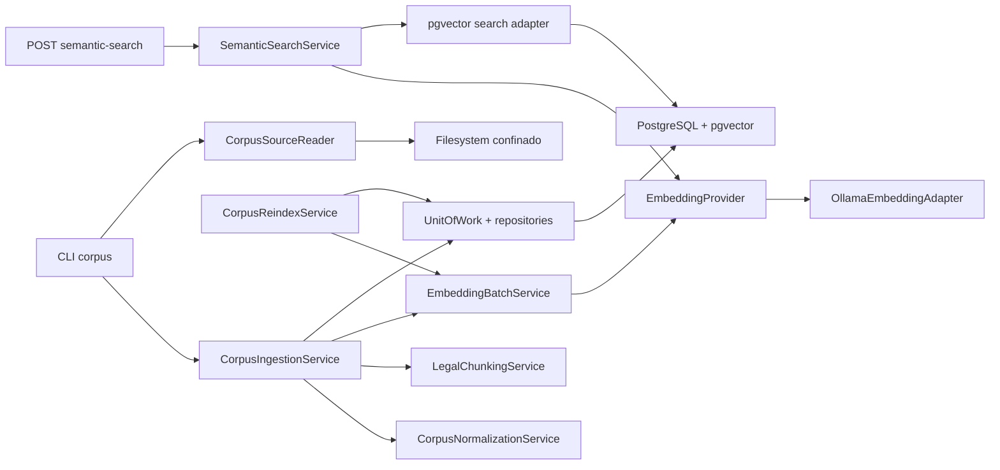
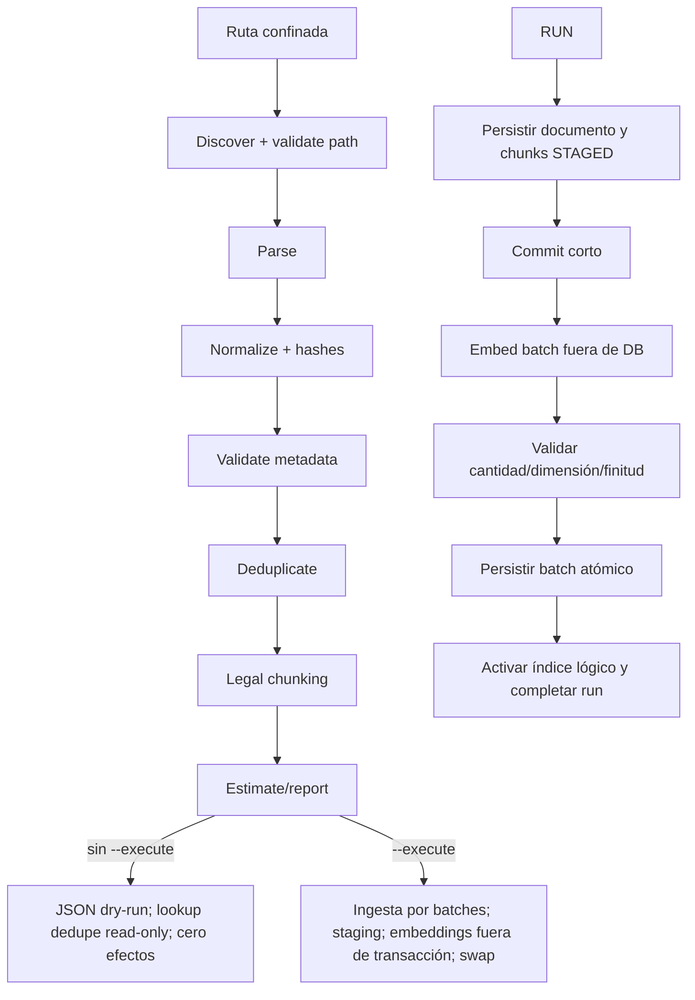

# Plan de arquitectura: Ingesta de corpus y recuperación semántica

**Rama**: `005-corpus-ingestion-and-semantic-retrieval` | **Fecha**: 2026-08-04 | **Spec**: [spec.md](spec.md)
**Estado**: `IMPLEMENTATION_EXTERNAL_GATE_PENDING`
**Alcance del documento**: diseño y secuenciación; no implementa código.

## Resumen

El incremento incorpora un subsistema hexagonal para ingerir un corpus local de
decretos de designación transitoria, normalizarlo y fragmentarlo de forma
determinista, generar embeddings mediante Ollama, persistirlos en PostgreSQL con
pgvector y recuperar antecedentes mediante similitud coseno y filtros estrictos.

El diseño reutiliza los patrones existentes de configuración tipada,
`UnitOfWork`, repositorios SQLAlchemy, handlers uniformes, observabilidad y
health/readiness. La inferencia ocurre siempre fuera de transacciones. La
búsqueda exacta es el baseline. La migración 005 usa `vector(1024)`, dimensión
confirmada empíricamente para `qwen3-embedding:0.6b`; la conectividad externa se
valida por separado en G1-B.

## Contexto técnico

| Área | Decisión |
|---|---|
| Lenguaje/runtime | Python 3.12, async donde ya lo usa la aplicación |
| API y schemas | FastAPI + Pydantic, preservando el envelope 003–004 |
| Persistencia | PostgreSQL 16, SQLAlchemy async, Alembic y pgvector |
| Proveedor | Ollama externo mediante `POST /api/embed`, HTTPS/Bearer |
| Modelo | Tag exacto `qwen3-embedding:0.6b` (~639 MB, 596M, Q8_0) |
| Dimensión | Contractual: 1024, confirmada empíricamente en el servidor Ollama |
| Contexto/capacidad | 32K, multilingüe e instruction-aware |
| Distancia | Coseno con `<=>`; `similarity_score = clamp(1 - cosine_distance, 0, 1)` |
| Índice inicial | Exact search + B-tree para filtros; sin ANN en MVP inicial |
| Concurrencia | `InferenceCoordinator`: una inferencia activa; INTERACTIVE > SEARCH > BATCH_INGESTION |
| Transacciones | Cortas; nunca abarcan llamadas al filesystem u Ollama |
| CLI | `corpus ingest` dry-run por defecto; `--execute` habilita la ingesta por fases 11+ con persistencia atómica |
| Tests | pytest unit/contract/integration; fake determinista por defecto |
| Calidad | Ruff, mypy estricto, cobertura ≥85%, migración round-trip |
| Despliegue | Reutiliza API, PostgreSQL, Docker Compose y Ollama existentes |

## Constitution Check

### Gate previo al diseño

| Principio | Evidencia de cumplimiento | Estado |
|---|---|---|
| I Seguridad y privacidad | Ollama privado, corpus no confiable, paths confinados, logs minimizados | PASS |
| II Asistencia | Los resultados son antecedentes; no aprueban ni generan actos | PASS |
| III Trazabilidad | Runs, failures, batches y búsquedas auditables | PASS |
| IV Fuentes | Todo resultado conserva documento, fuente, sección y score | PASS |
| VI Calidad del corpus | Original protegido, procesado, procedencia y revisión humana | PASS |
| VII Chunking jurídico | Secciones jurídicas y orden estable | PASS |
| VIII RAG antes de fine-tuning | Solo recuperación; sin fine-tuning ni generación RAG | PASS |
| IX Evaluación | Precision/Recall/MRR y utilidad jurídica humana versionadas | PASS |
| X Arquitectura modular | Dominio, aplicación, puertos y adaptadores separados | PASS |
| XVI Pruebas | Fakes y pruebas proporcionales al riesgo | PASS |
| XVII Resiliencia | Retry acotado, resume, health y fallas no corruptivas | PASS |
| XVIII Versionado | Modelo, dimensión, normalización, chunking y dataset versionados | PASS |
| XIX Incremental | Baseline exacto antes de ANN; 005 separado de 006 | PASS |
| XX Simplicidad | Sin Redis, colas, cloud DB ni nuevos servicios | PASS |

No hay violaciones constitucionales. G1 es un gate técnico, no una excepción.

## Arquitectura hexagonal



### Dominio

- `CorpusDocument`, `CorpusChunk`, `IngestionRun`, `IngestionFailure`,
  `EmbeddingBatch` y `SemanticSearchRun` como entidades sin dependencias de
  FastAPI, SQLAlchemy, filesystem u Ollama.
- Enums contractuales para etapas, fallas, sección jurídica, estado de embedding,
  estado de batch y estado de búsqueda.
- Value objects para hash SHA-256, versión, modelo/dimensión y posición de chunk.
- Invariantes: dimensión positiva y homogénea; valores finitos; orden estable;
  no duplicación por fuente/external_id o hash; estados válidos.

### Aplicación

- `CorpusNormalizationService`: normalización NFC, limpieza conservadora y hashes.
- `LegalChunkingService`: detección de secciones y fallback determinista.
- `EmbeddingBatchService`: batching, límites, validación y retry transitorio.
- `CorpusIngestionService`: dry-run puro y ejecución reanudable.
- `CorpusReindexService`: generación en staging y activación atómica.
- `SemanticSearchService`: normalización, embedding, búsqueda, ranking y auditoría.
- `CorpusReviewService`: carga por repositorio/UoW, validación de existencia,
  `expected_version` y transición, approve/reject, revisor/motivo, actualización de
  procedencia/revisión y auditoría. El CLI depende del servicio y no toca ORM,
  entidades o repositorios directamente.
- `InferenceCoordinator`: cola local acotada, prioridades, timeout, cancelación,
  métricas y exclusión mutua sobre el único slot remoto.
- Coordinación mediante fábricas de UoW cortas, no una sesión abierta de extremo a extremo.

### Puertos

- `EmbeddingProvider`, `CorpusSourceReader`, `InferenceCoordinationPort`.
- `CorpusDocumentRepository`, `CorpusChunkRepository`,
  `IngestionRunRepository`, `IngestionFailureRepository`,
  `EmbeddingBatchRepository`, `SemanticSearchRunRepository`.
- `VectorSearchPort`, `UnitOfWorkFactory`, `Clock` y `MetricsPort`.
- El puerto de coordinación permite integración posterior de generación sin
  modificar contratos funcionales de 001–004.

### Adaptadores

- `OllamaEmbeddingAdapter` separado del cliente generativo actual.
- Repositorios SQLAlchemy y search adapter pgvector.
- Reader de filesystem para TXT/JSON/HTML sin ejecución.
- CLI `corpus`, router FastAPI interno, logging estructurado y health adapter.
- Fake embeddings determinista que preserva cantidad/dimensión contractual.

## Pipeline offline



### Decisión sobre chunks antes de embeddings

Los chunks se persisten antes del embedding en estado `STAGED`, sin vector y no
visibles para búsqueda. Esto permite resume por chunk/hash sin retener una
transacción durante inferencia. Un batch válido actualiza vectores y estado en
una transacción corta. Un batch inválido no publica ninguno de sus vectores.
Solo chunks `ACTIVE` del índice lógico activo participan en búsqueda.

### Estados y recovery

- Documento: `DISCOVERED → PARSED → NORMALIZED → VALIDATED → CHUNKED →
  EMBEDDING → INDEXED → COMPLETED`, con fallas específicas.
- Chunk: `STAGED → EMBEDDING → ACTIVE`; `FAILED` o `SUPERSEDED` no se buscan.
- Batch: `PENDING → PROCESSING → SUCCEEDED`; `FAILED_RETRYABLE` reanuda y
  `FAILED_FINAL` exige intervención/configuración corregida.
- Resume toma el `run_id`, bloquea la fila de run, verifica el snapshot de
  configuración y continúa desde batches no confirmados. Un snapshot distinto
  produce `INGESTION_RESUME_CONFLICT`.

## Reindexación

Se exige reindexación completa —o una generación nueva seguida de swap lógico—
ante cualquier cambio de `embedding_model`, `embedding_dimensions`,
`normalization_version` o `chunking_version`. Ninguno de esos cambios puede
actualizar en sitio una generación activa ni mezclar resultados antiguos/nuevos.

1. Seleccionar documentos y registrar ejecución con configuración objetivo.
2. Crear una nueva `index_generation` lógica y chunks `STAGED` sin afectar la
   generación activa.
3. Generar embeddings fuera de transacción, validar y confirmar por batch.
4. Verificar cobertura completa, modelo, dimensión y hashes.
5. En una transacción corta, marcar la nueva generación `ACTIVE` y la anterior
   `SUPERSEDED` por documento.
6. Conservar la anterior para rollback lógico hasta la política de limpieza.

PostgreSQL aplica además un constraint trigger diferible sobre documentos y chunks:
al commit valida que exista como máximo una generación ACTIVE por documento, que
todo chunk ACTIVE pertenezca a `active_generation` y que el puntero no refiera una
generación inexistente. El trigger permite los estados intermedios del staging y
se elimina junto con su función en el downgrade.

Las búsquedas fijan una generación activa al iniciar. No hay mezcla de modelos o
dimensiones. El resume continúa la generación staging; jamás borra primero la
generación activa.

## Búsqueda online

1. Validar query y los filtros MVP obligatorios `document_type=decreto`,
   `document_subtype=designacion_transitoria` y `jurisdiction=nacion`.
   `language`, `organization`, `minimum_score` y `top_k` son opcionales;
   `review_status` se fija en `REVIEWED` por defecto y solo admite
   `PENDING_REVIEW` en evaluación administrativa explícita. Toda clave, tipo,
   valor anidado o valor fuera de la allowlist falla con
   `INVALID_SEMANTIC_SEARCH_FILTERS` antes de llamar a Ollama.
2. Normalizar query; añadir la instrucción de retrieval versionada solo si la
   evaluación demuestra mejora y usarla consistentemente.
3. Generar un único embedding con modelo/dimensión del índice activo.
4. Validar vector y ejecutar consulta exacta filtrada por metadata y generación.
5. Calcular `cosine_distance = embedding <=> query_vector` y
   `similarity_score = clamp(1 - cosine_distance, 0, 1)`.
6. Aplicar `minimum_score`, ordenar por score DESC, `publication_date` DESC NULLS
   LAST, `document_id` ASC, `section_index` ASC y limitar a `top_k`.
7. Persistir `semantic_search_runs` minimizada (`SUCCEEDED`/`FAILED`; timeout como
   `FAILED` con `SEMANTIC_SEARCH_TIMEOUT`) y confirmar su commit; `request_id` es
   obligatorio, `minimum_score` puede ser nulo y nunca se persisten query, vector o
   resultados.
8. Solo entonces responder con envelope y excerpts limitados. Si la auditoría
   falla o vence su timeout, aplicar fail-closed: HTTP 503,
   `SEMANTIC_SEARCH_AUDIT_UNAVAILABLE`, cero resultados parciales y como máximo un
   retry acotado ante un fallo claramente transitorio.

Por defecto solo se buscan documentos `REVIEWED`. La evaluación administrativa
puede incluir `PENDING_REVIEW` mediante opt-in explícito; `REJECTED` nunca se
recupera. No se abre una transacción DB durante la espera ni llamada a Ollama.

## Coordinación de inferencia

`InferenceCoordinator` implementa `InferenceCoordinationPort` y vive en la API
local, sin Redis, Celery ni Kafka. Adaptadores y servicios reciben el puerto por
inyección; el nombre de la interfaz nunca se reutiliza para la clase. Su cola
acotada aplica `INTERACTIVE` > `SEARCH` > `BATCH_INGESTION`; 005 usa las dos últimas
y reserva `INTERACTIVE` para integración posterior. La prioridad adelanta nuevos
batches, no interrumpe inferencias iniciadas. Cada batch hace yield antes del
siguiente slot. Timeout, cancelación y error liberan el slot y generan métricas
sanitizadas. Fairness acotada impide monopolio y deadlock.

## Persistencia e índices

La integración ORM usa la dependencia Python oficial `pgvector` y `Vector(1024)`,
con versión reproducible en `pyproject.toml` y lockfile; no se implementa SQL
vectorial manual. Debe ser compatible con la extensión PostgreSQL existente.

`corpus_documents` conserva `raw_content` protegido, original/normalizado y hashes,
fuente/identificador sanitizado, procedencia, revisión y versiones de pipeline,
normalización y chunking. Todo documento inicia `PENDING_REVIEW`; el flujo CLI
administrativo permite aprobar o rechazar con motivo.

La revisión usa CAS PostgreSQL: `review_version INTEGER NOT NULL DEFAULT 1` y un
único `UPDATE ... WHERE id=:id AND review_version=:expected_version AND
review_status=:expected_status` que incrementa exactamente uno. Servicio, repositorio
y auditoría comparten UoW. Si no actualiza filas, una lectura minimizada discrimina
not-found, mismatch o transición inválida. Dos revisores con igual versión producen
un ganador, un 409 estable y una sola auditoría, sin lost update.

“Protegido” implica credenciales backend, roles DB mínimos, acceso exclusivo vía
`CorpusDocumentRepository`/`CorpusReviewService` o herramienta administrativa
autorizada, mappers explícitos ORM→dominio→DTO y ningún endpoint público de descarga
en 005. ORM y contenido completo se excluyen de rutas, serialización genérica,
DTOs, schemas, logs, excepciones y métricas. No se introduce cifrado de columna.

`human_retrieval_evaluations` persiste utilidad 1–5 y relevancia legal por resultado
con evaluador seudónimo y dataset versionado.

- Migración 005 valida `vector` pero no elimina la extensión en downgrade.
- La migración 005 usará `vector(1024)` y validará estrictamente esa dimensión.
- B-tree: `(document_type, document_subtype, jurisdiction)`, hash normalizado,
  run/status y generación activa. La identidad usa dos unique parciales:
  `(source_name, external_id) WHERE ingestion_status <> 'FAILED'` y
  `(source_identifier, raw_content_hash, normalized_content_hash) WHERE
  active_generation IS NOT NULL AND ingestion_status <> 'FAILED'`. Así las filas
  fallidas o sin generación activa permanecen como histórico/staging sin competir
  con una identidad vigente.
- Baseline sin índice ANN: exact search con filtros selectivos y `LIMIT`.
- Ejecutar `ANALYZE` tras carga representativa y conservar `EXPLAIN (ANALYZE,
  BUFFERS)` sanitizado como evidencia.
- HNSW solo tras Gate G2: volumen/latencia lo justifican y recall contra exact es
  aceptable. La dimensión esperada 1024 es compatible con el límite de 2000
  dimensiones de HNSW sobre `vector`, por lo que G1 ya no lo bloquea por tamaño.
- No introducir `halfvec`, subvector ni otra reducción dimensional sin evaluación
  de calidad y decisión explícita. IVFFlat queda fuera del MVP.

## Configuración

Agregar sin secretos: `OLLAMA_EMBEDDING_MODEL=qwen3-embedding:0.6b`,
`OLLAMA_EMBEDDING_TIMEOUT_SECONDS`, `EMBEDDING_DIMENSIONS=1024`,
`OLLAMA_EMBEDDING_BATCH_SIZE`, `CORPUS_MAX_FILE_SIZE_BYTES`,
`CORPUS_MAX_BATCH_FILES`, `CORPUS_ALLOWED_EXTENSIONS`,
`SEMANTIC_SEARCH_MAX_TOP_K`, `SEMANTIC_SEARCH_TIMEOUT_SECONDS` y versiones de
normalización/chunking/dataset. Reutilizar base URL y token existentes, pero no
el adaptador generativo.

## Health y readiness

- Liveness solo comprueba el proceso.
- Readiness general conserva la semántica existente para 001–004.
- Añadir estado de capability `semantic_retrieval`: DB, extensión, modelo,
  dimensión y proveedor.
- Ollama caído marca esta capability `degraded/not_ready` para ingesta ejecutada
  y búsqueda, sin hacer que lecturas, drafts, review o export de 001–004 fallen.

## Observabilidad y seguridad

- Correlación: `request_id`, `ingestion_run_id`, `batch_id`, `document_id`,
  `query_id`; métricas de conteo/duración por etapa y códigos estables.
- Prohibidos: contenido, query completa, token, vector, paths absolutos y stack traces.
- Reader resuelve path canónico dentro del root, rechaza traversal y cualquier
  symlink, valida archivo regular, extensión/tamaño y lectura acotada.
- HTML se parsea como datos; no se ejecutan scripts, estilos, URLs o recursos.
- Retry: 408/429/5xx y errores de conexión; no retry para 400/401/403/404/422.
- Backoff acotado con jitter determinista desactivable en tests.

## Fases de implementación posteriores

1. **Infraestructura base**: configuración contractual 0.6B/1024, migración 005
   y validación separada del subgate externo G1-B.
2. **Dominio y persistencia**: entidades, enums, modelos, repositorios y UoW.
3. **Pipeline puro**: readers, normalización, metadata y chunking con unit tests.
4. **Embeddings**: puerto, fake, adapter real, batches y pruebas contractuales.
5. **Ingesta CLI**: dry-run, `--execute`, resume, fallas y JSON.
6. **Reindexación**: staging, generación, swap y rollback lógico.
7. **Búsqueda**: servicio, pgvector exact, endpoint y auditoría.
8. **Evaluación/operación**: dataset, métricas, health, runbook y benchmarks.
9. **Validación final**: migración round-trip, regresión 001–004, seguridad y docs.

## Planning gates

| Gate | Condición | Bloquea |
|---|---|---|
| G1-A Modelo/dimensión | CERRADO: Ollama devolvió dos vectores válidos de 1024 con `qwen3-embedding:0.6b` | Nada; habilita `vector(1024)` y tareas |
| G1-B Conectividad E2E | ABIERTO: falta validar Docker/local → HTTPS/Bearer → Funnel/Nginx → Ollama remoto | Aceptación operativa externa; no cambia modelo/dimensión |
| G2 ANN | Volumen + EXPLAIN + benchmark demuestran necesidad y compatibilidad | Creación de HNSW |
| G3 Calidad | Baseline informativo Recall/Precision@3/5, MRR, utilidad y relevancia | Sin umbral previo; no bloquea CI inicialmente |
| G4 Operación | Límites y timeout aprobados en entorno objetivo | Ejecución masiva con `--execute` |

## Matriz de errores

| Código | HTTP/CLI | Retry | Efecto |
|---|---:|---|---|
| `CORPUS_PATH_INVALID` | 422/2 | No | Rechaza antes de leer |
| `CORPUS_FILE_TOO_LARGE` | 413/2 | No | Falla archivo |
| `CORPUS_PARSE_FAILED` | 422/1 | No | Registra failure si execute |
| `CORPUS_METADATA_INVALID` | 422/1 | No | No persiste documento activo |
| `EMBEDDING_PROVIDER_UNAVAILABLE` | 503/1 | Sí | Batch reanudable |
| `EMBEDDING_AUTH_FAILED` | 503/2 | No | Configuración inválida |
| `EMBEDDING_DIMENSION_MISMATCH` | 409/2 | No | Cero vectores del batch |
| `EMBEDDING_RESPONSE_INVALID` | 502/1 | Según causa | Cero vectores del batch |
| `INGESTION_RESUME_CONFLICT` | 409/2 | No | Run sin cambios |
| `INDEX_GENERATION_CONFLICT` | 409/2 | Sí manual | Conserva activa anterior |
| `INVALID_SEMANTIC_SEARCH_FILTERS` | 422 | No | No llama Ollama |
| `SEMANTIC_SEARCH_TIMEOUT` | 504 | Sí cliente | Audit sanitizada |
| `SEMANTIC_INDEX_INCOMPATIBLE` | 503 | No | No compara vectores |
| `DATABASE_ERROR` | 503/1 | Sí | Rollback corto |

## Matriz de tests

| Capa | Cobertura mínima |
|---|---|
| Dominio | estados, invariantes, hashes, dimensión, deduplicación |
| Normalización | Unicode/BOM/controles/párrafos/variantes/idempotencia |
| Chunking | secciones, artículos, citas, largos, fallback, orden |
| Reader | txt/json/html, límites, traversal, symlink, TOCTOU básico |
| Embeddings | batch/query, 4xx/429/5xx/timeout, cantidad, NaN, infinito, dimensión |
| Ingesta | dry-run cero efectos, execute, duplicate/update/resume/fail-fast |
| Reindex | staging, fallo, resume, swap, rollback, búsquedas concurrentes |
| Search | filtros, score, top_k, threshold, empate, vacío, mismatch, auditoría |
| Auditoría fail-closed | éxito, DB caída/timeout, rollback, retry acotado y cero respuesta parcial |
| Revisión | PENDING inicial, approve/reject, filtros y no exposición del original |
| CAS de revisión | versión correcta/menor/mayor, dos approve, approve-vs-reject, un ganador, rollback y auditoría única |
| Coordinación | exclusión mutua, prioridad, fairness, timeout, cancelación y no deadlock |
| Migración | upgrade/downgrade, constraints, índices, dimensión G1 |
| Evaluación | fake/real opt-in; Recall/Precision/MRR, latencias y juicio humano |
| Regresión | suite completa 001–004 con Ollama embeddings caído |

## Estructura del proyecto

```text
apps/api/src/legal_ai/
├── domain/corpus*.py
├── application/corpus_*.py
├── ports/{embedding,corpus,semantic_search}.py
├── adapters/database/{models,corpus_*_repository}.py
├── adapters/ollama_embedding.py
├── adapters/filesystem_corpus.py
├── api/semantic_search.py
├── cli/corpus.py
└── config.py
apps/api/alembic/versions/005_*.py
apps/api/tests/{unit,contract,integration}/
specs/005-corpus-ingestion-and-semantic-retrieval/
├── spec.md
├── plan.md
├── research.md
├── data-model.md
├── quickstart.md
└── contracts/
    ├── http-api.md
    └── corpus-cli.md
```

## Post-design Constitution Check

PASS. El diseño mantiene aislamiento, trazabilidad, evaluación, arquitectura
hexagonal, simplicidad y compatibilidad. No modifica constitución, principios ni
contratos 001–004 y no conecta recuperación con generación.

## Riesgos y supuestos

- La dimensión 1024 ya es contractual por evidencia empírica local del servidor;
  G1-A está cerrado y la ruta externa G1-B sigue pendiente desde Docker/local.
  G1-B no bloquea implementación ni migración `vector(1024)`; solo bloquea
  aceptación operativa remota, cierre externo completo y smoke real.
- 1024 reduce almacenamiento y es indexable por HNSW `vector`; exact search sigue
  siendo el baseline apropiado para el corpus inicial.
- El servidor con un modelo cargado puede desalojar al generador; ingestas deben
  coordinarse operativamente y `keep_alive` no debe monopolizar GPU.
- Los metadatos del corpus pueden requerir reglas específicas de fuente; archivos
  que no cumplan fallan validación en vez de inferir silenciosamente.
- La política de limpieza de generaciones superseded se diseña como runbook y no
  como borrado automático en 005.

## Veredicto

`BLOCKED_EXTERNAL`

El planning fija `qwen3-embedding:0.6b`, `EMBEDDING_DIMENSIONS=1024` y
`vector(1024)`. G1-A está cerrado. G1-B permanece `BLOCKED_EXTERNAL`: la única
ejecución autorizada desde Docker/local recibió 404 en `/api/embed`. Esto no
reabre la dimensión; solo impide la aceptación operativa externa.
