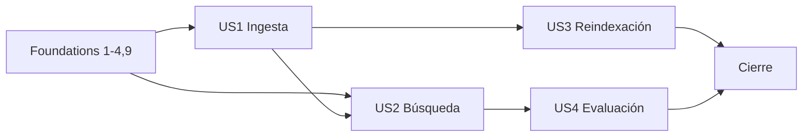

# Tasks: Ingesta de corpus y recuperación semántica

**Input**: artefactos de `specs/005-corpus-ingestion-and-semantic-retrieval/`
**Estado de entrada**: `IMPLEMENTATION_EXTERNAL_GATE_CLOSED`
**Contrato**: `qwen3-embedding:4b-q4_K_M`, `halfvec(2560)`, exact search baseline
**Organización**: 18 fases; US1 ingesta, US2 búsqueda, US3 reindexación, US4 evaluación.

## Formato

- `[P]` indica trabajo paralelizable en archivos distintos y sin dependencia pendiente.
- `[US1]` ingesta segura y reproducible.
- `[US2]` recuperación semántica filtrada.
- `[US3]` reindexación sin pérdida.
- `[US4]` evaluación reproducible.

## Phase 1 — Preparación y configuración

**Propósito**: fijar configuración contractual y límites compartidos.

- [X] T001 Agregar dependencia oficial `pgvector` y herramienta de auditoría adoptada con versiones reproducibles en `apps/api/pyproject.toml` y `apps/api/uv.lock`
- [X] T002 Agregar variables seguras en `.env.example` y settings tipados con `OLLAMA_EMBEDDING_MODEL=qwen3-embedding:4b-q4_K_M`, `EMBEDDING_DIMENSIONS=2560` y búsqueda solo REVIEWED por defecto en `apps/api/src/legal_ai/config.py`
- [X] T003 Definir batch size, timeout, máximo de bytes de input y límites de corpus en `apps/api/src/legal_ai/config.py`
- [X] T004 Definir extensiones permitidas, máximo `top_k` y timeout de búsqueda en `apps/api/src/legal_ai/config.py`
- [X] T005 Validar compatibilidad de los nuevos settings con `OllamaConfig` existente en `apps/api/src/legal_ai/config.py`
- [X] T006 [P] Crear pruebas de defaults, overrides y límites de configuración en `apps/api/tests/unit/test_corpus_config.py`
- [X] T007 [P] Crear pruebas de rechazo de modelo/dimensión incompatibles en `apps/api/tests/unit/test_embedding_config.py`
- [X] T008 Documentar la configuración contractual y ausencia de secretos en `README.md`

**Checkpoint**: configuración 005 validada sin cambiar contratos 001–004.

## Phase 2 — Migración y modelo de datos

**Propósito**: crear persistencia 005 reversible, sin HNSW inicial.

- [X] T009 Crear enums/tablas con raw protegido, revisión, `review_version INTEGER NOT NULL DEFAULT 1` y `halfvec(2560)` en `apps/api/alembic/versions/005_corpus_ingestion_semantic_retrieval.py`
- [X] T010 Agregar `ingestion_runs`, `ingestion_failures` y `embedding_batches` en `apps/api/alembic/versions/005_corpus_ingestion_semantic_retrieval.py`
- [X] T011 Agregar `semantic_search_runs` minimizada y `human_retrieval_evaluations` en `apps/api/alembic/versions/005_corpus_ingestion_semantic_retrieval.py`
- [X] T012 Agregar FK y checks de `review_version > 0`, estados, dimensión/finitud y timestamps en `apps/api/alembic/versions/005_corpus_ingestion_semantic_retrieval.py`
- [X] T013 Agregar uniques parciales de identidad, hashes, generación y `run_id` en `apps/api/alembic/versions/005_corpus_ingestion_semantic_retrieval.py`
- [X] T014 Agregar índices B-tree para filtros, estados, auditoría e identidad sin crear HNSW en `apps/api/alembic/versions/005_corpus_ingestion_semantic_retrieval.py`
- [X] T015 Implementar downgrade que retire solo objetos 005 y preserve pgvector/001–004 en `apps/api/alembic/versions/005_corpus_ingestion_semantic_retrieval.py`
- [X] T016 [P] Crear modelos SQLAlchemy con `review_version` y `HALFVEC(2560)` para documentos/revisión, chunks y generaciones en `apps/api/src/legal_ai/adapters/database/corpus_models.py`
- [X] T017 [P] Crear modelos SQLAlchemy para runs, failures y batches en `apps/api/src/legal_ai/adapters/database/ingestion_models.py`
- [X] T018 [P] Crear modelos SQLAlchemy minimizados de búsquedas y evaluaciones humanas en `apps/api/src/legal_ai/adapters/database/semantic_search_models.py`
- [X] T019 Crear tests de upgrade/downgrade y preservación de pgvector en `apps/api/tests/integration/test_005_migrations.py`
- [X] T020 Probar default/check de `review_version`, revisión/procedencia, constraints, uniques y mapping `HALFVEC(2560)` en `apps/api/tests/integration/test_005_migrations.py`
- [X] T021 Agregar test round-trip 004→005→004 que compare objetos 001–004 en `apps/api/tests/integration/test_005_migrations.py`

**Checkpoint**: migración reversible y modelos persistentes disponibles.

## Phase 3 — Dominio y puertos

**Propósito**: establecer contratos hexagonales compartidos.

- [X] T022 [P] Crear entidades, procedencia, revisión y errores de documento/chunk en `apps/api/src/legal_ai/domain/corpus.py`
- [X] T023 [P] Crear entidades y estados de runs, failures y batches en `apps/api/src/legal_ai/domain/ingestion.py`
- [X] T024 [P] Crear `SemanticSearchRun`, `HumanRetrievalEvaluation` y value objects de búsqueda/evaluación en `apps/api/src/legal_ai/domain/semantic_search.py`
- [X] T025 Implementar invariantes de modelo, dimensión 2560, finitud, hashes y transiciones en `apps/api/src/legal_ai/domain/corpus.py`
- [X] T026 [P] Definir `EmbeddingProvider`, `InferenceCoordinationPort`, prioridades y DTOs en `apps/api/src/legal_ai/ports/embedding.py`
- [X] T027 [P] Definir `CorpusSourceReader` y source identifiers sanitizados en `apps/api/src/legal_ai/ports/corpus_source.py`
- [X] T028 [P] Definir puertos de repositorios de corpus e ingesta en `apps/api/src/legal_ai/ports/corpus_repositories.py`
- [X] T029 [P] Definir `VectorSearchPort` y `SemanticSearchRunRepository` en `apps/api/src/legal_ai/ports/semantic_search.py`
- [X] T030 [P] Definir `MetricsPort`, clock y DTOs de medición 005 en `apps/api/src/legal_ai/ports/corpus_metrics.py`
- [X] T031 Extender el contrato de Unit of Work con repositorios 005 en `apps/api/src/legal_ai/ports/unit_of_work.py`
- [X] T032 [P] Crear tests de entidades, raw protegido, PENDING/approve/reject, procedencia e invariantes en `apps/api/tests/unit/test_corpus_domain.py`
- [X] T033 [P] Crear tests unitarios de estados de ingesta y búsquedas minimizadas en `apps/api/tests/unit/test_ingestion_domain.py`

**Checkpoint**: dominio independiente de FastAPI, SQLAlchemy, filesystem y Ollama.

## Phase 4 — Adaptador de embeddings

**Propósito**: implementar inferencia reemplazable y testeable; G1-B queda separado.

- [X] T034 [P] Implementar `FakeEmbeddingProvider` determinista y fallos configurables en `apps/api/src/legal_ai/adapters/embeddings/fake_embedding.py`
- [X] T035 Implementar `InferenceCoordinator` conforme a `InferenceCoordinationPort`, con un slot, cola acotada, prioridades, fairness, timeout y cancelación en `apps/api/src/legal_ai/application/inference_coordinator.py`
- [X] T036 Implementar cliente de embeddings configurable (`/api/embed` batch nativo o `/api/embeddings` secuencial), Bearer, `embed_documents`, `embed_query` y health en `apps/api/src/legal_ai/adapters/ollama_embedding.py`
- [X] T037 Implementar clasificación de 4xx/429/5xx, retry transitorio y backoff acotado en `apps/api/src/legal_ai/adapters/ollama_embedding.py`
- [X] T038 Implementar validación de cantidad, dimensión 2560, finitud y vector no vacío en `apps/api/src/legal_ai/adapters/ollama_embedding.py`
- [X] T039 Implementar errores sanitizados sin token, contenido, URL completa o vectores en `apps/api/src/legal_ai/adapters/ollama_embedding.py`
- [X] T040 [P] Probar `FakeEmbeddingProvider`: determinismo, embed_documents/query, batch, 2560, cantidad, fallos, timeout, dimensión/NaN/infinito/vector vacío configurables en `apps/api/tests/unit/adapters/test_fake_embedding.py`
- [X] T041 [P] Probar slot único, prioridades SEARCH/INTERACTIVE, siguiente batch, timeout, cancelación, liberación, fairness y no deadlock en `apps/api/tests/unit/application/test_inference_coordinator.py`
- [X] T042 Crear tests contractuales de request/response, Bearer y dimensión en `apps/api/tests/contract/test_ollama_embedding_contract.py`
- [X] T043 Agregar modelo inexistente, input string/list vacíos, dimensions 0/negativa/>2560, 401/403/429/5xx/timeout, retry solo transitorio y no retry 4xx contractual en `apps/api/tests/contract/test_ollama_embedding_contract.py`
- [X] T044 Agregar cantidad incorrecta, dimensión distinta de 2560, vector vacío, NaN e infinito en `apps/api/tests/contract/test_ollama_embedding_contract.py`

**Checkpoint**: tests ordinarios no dependen de Ollama real.

## Phase 5 — Lectores del corpus

**Story**: US1
**Prueba independiente**: fixture mixto descubre solo archivos válidos en orden estable y rechaza escapes.

- [X] T045 [P] [US1] Implementar confinamiento de root, path canónico y rechazo de symlinks en `apps/api/src/legal_ai/adapters/filesystem_corpus.py`
- [X] T046 [US1] Implementar discovery estable, límites de cantidad/tamaño y source identifiers en `apps/api/src/legal_ai/adapters/filesystem_corpus.py`
- [X] T047 [US1] Implementar lectura TXT con encoding controlado en `apps/api/src/legal_ai/adapters/filesystem_corpus.py`
- [X] T048 [US1] Implementar extracción JSON contractual en `apps/api/src/legal_ai/adapters/filesystem_corpus.py`
- [X] T049 [US1] Implementar extracción HTML sin ejecución, red ni recursos externos en `apps/api/src/legal_ai/adapters/filesystem_corpus.py`
- [X] T050 [P] [US1] Crear tests TXT/JSON/HTML, encoding y orden en `apps/api/tests/unit/test_filesystem_corpus.py`
- [X] T051 [US1] Agregar tests traversal, symlink, extensión/MIME y límite exacto/+1 en `apps/api/tests/unit/test_filesystem_corpus.py`

## Phase 6 — Normalización

**Story**: US1
**Prueba independiente**: normalizar dos veces produce exactamente el mismo texto y hash.

- [X] T052 [US1] Implementar Unicode NFC, BOM, saltos y controles inválidos en `apps/api/src/legal_ai/application/corpus_normalization.py`
- [X] T053 [US1] Implementar espacios/párrafos y limpieza configurable de headers/footers/web en `apps/api/src/legal_ai/application/corpus_normalization.py`
- [X] T054 [US1] Implementar variantes ARTÍCULO/ARTICULO, ordinales, VISTO y CONSIDERANDO sin alterar sustancia en `apps/api/src/legal_ai/application/corpus_normalization.py`
- [X] T055 [US1] Implementar preservación de normas, expedientes, fechas y organismos en `apps/api/src/legal_ai/application/corpus_normalization.py`
- [X] T056 [US1] Implementar hashes original/normalizado y `normalization_version` en `apps/api/src/legal_ai/application/corpus_normalization.py`
- [X] T057 [P] [US1] Crear tests Unicode, BOM, controles, saltos, espacios y párrafos en `apps/api/tests/unit/test_corpus_normalization.py`
- [X] T058 [US1] Agregar tests de variantes jurídicas, preservación, hashes e idempotencia en `apps/api/tests/unit/test_corpus_normalization.py`

## Phase 7 — Metadatos

**Story**: US1
**Prueba independiente**: metadata MVP válida se normaliza; faltantes/enums inválidos fallan sin persistencia.

- [X] T059 [P] [US1] Crear schemas estrictos de metadata obligatoria/opcional en `apps/api/src/legal_ai/schemas/corpus_metadata.py`
- [X] T060 [US1] Implementar normalización y defaults documentados de metadata en `apps/api/src/legal_ai/application/corpus_metadata.py`
- [X] T061 [US1] Implementar validación de external_id, fuente, tipo, subtipo, jurisdicción e idioma en `apps/api/src/legal_ai/application/corpus_metadata.py`
- [X] T062 [US1] Implementar campos opcionales y errores sanitizados de metadata en `apps/api/src/legal_ai/application/corpus_metadata.py`
- [X] T063 [P] [US1] Crear tests de schemas, enums, defaults y campos opcionales en `apps/api/tests/unit/test_corpus_metadata.py`
- [X] T064 [US1] Agregar tests de faltantes, unknown documentado y normalización en `apps/api/tests/unit/test_corpus_metadata.py`

## Phase 8 — Chunking jurídico

**Story**: US1
**Prueba independiente**: decreto fixture conserva secciones, artículos, orden e índices estables.

- [X] T065 [US1] Implementar detector de HEADER, TITLE, VISTO y CONSIDERANDO en `apps/api/src/legal_ai/application/legal_chunking.py`
- [X] T066 [US1] Implementar DISPOSITIVE_INTRO, ARTICLE, CLOSING, AUTHORITY y SIGNATURE en `apps/api/src/legal_ai/application/legal_chunking.py`
- [X] T067 [US1] Implementar UNKNOWN, fallback por párrafos y variantes ortográficas en `apps/api/src/legal_ai/application/legal_chunking.py`
- [X] T068 [US1] Implementar límites, overlap mínimo, artículos indivisibles y protección de citas en `apps/api/src/legal_ai/application/legal_chunking.py`
- [X] T069 [US1] Implementar section/paragraph index, article_number, token estimate y `chunking_version` en `apps/api/src/legal_ai/application/legal_chunking.py`
- [X] T070 [P] [US1] Crear fixtures jurídicos reales/sintéticos sin PII en `apps/api/tests/fixtures/corpus/decretos/`
- [X] T071 [US1] Crear tests de secciones, variantes, artículos, firma y fallback en `apps/api/tests/unit/test_legal_chunking.py`
- [X] T072 [US1] Probar que no se cortan expediente, referencia normativa, Ley/Decreto/Resolución N°, fecha, artículo, organismo ni combinación expediente+norma; cubrir largos, orden e idempotencia en `apps/api/tests/unit/test_legal_chunking.py`

## Phase 9 — Repositorios y persistencia

**Propósito**: proveer persistencia compartida para US1–US3.

- [X] T073 [P] Implementar repositorio con acceso raw/mappers y CAS atómico por id, `review_version` y status esperado en `apps/api/src/legal_ai/adapters/database/corpus_document_repository.py`
- [X] T074 [P] Implementar repositorio de chunks/generaciones en `apps/api/src/legal_ai/adapters/database/corpus_chunk_repository.py`
- [X] T075 [P] Implementar repositorios de runs/failures/batches en `apps/api/src/legal_ai/adapters/database/ingestion_repository.py`
- [X] T076 [P] Implementar repositorios de auditoría de búsquedas y evaluaciones humanas en `apps/api/src/legal_ai/adapters/database/semantic_search_run_repository.py`
- [X] T077 Implementar exact vector search con `HALFVEC(2560)`, filtro REVIEWED por defecto, score y desempate en `apps/api/src/legal_ai/adapters/database/pgvector_search.py`
- [X] T078 Extender UnitOfWork concreto con repositorios 005 en `apps/api/src/legal_ai/adapters/database/unit_of_work.py`
- [X] T079 [P] Probar carga raw exclusiva, mappers y CAS que distingue inexistencia, mismatch y transición inválida en `apps/api/tests/integration/test_corpus_document_repository.py`
- [X] T080 [P] Crear tests de chunks, generaciones, batches y atomicidad en `apps/api/tests/integration/test_corpus_chunk_repository.py`
- [X] T081 [P] Crear tests de runs/failures y búsquedas minimizadas en `apps/api/tests/integration/test_ingestion_repositories.py`
- [X] T082 Crear tests de exact search, filtros, score clamp y orden estable en `apps/api/tests/integration/test_pgvector_search.py`

## Phase 10 — Ingesta dry-run

**Story**: US1
**Prueba independiente**: dry-run completo produce JSON y cero writes/requests de embeddings.

- [X] T083 [P] [US1] Crear schemas de opciones y reporte JSON de ingesta en `apps/api/src/legal_ai/schemas/corpus_cli.py`
- [X] T084 [US1] Implementar pipeline dry-run discovery→parse→normalize→metadata→dedupe estimate→chunk en `apps/api/src/legal_ai/application/corpus_ingestion.py`
- [X] T085 [US1] Implementar comando `corpus ingest PATH` dry-run por defecto en `apps/api/src/legal_ai/cli/corpus.py`
- [X] T086 [US1] Rechazar `--resume` sin `--execute` y no crear `ingestion_run` en `apps/api/src/legal_ai/cli/corpus.py`
- [X] T087 [US1] Registrar entry point `corpus` sin alterar `document-exports` en `apps/api/pyproject.toml`
- [X] T088 [P] [US1] Crear tests de pipeline/reportes dry-run en `apps/api/tests/unit/test_corpus_ingestion_dry_run.py`
- [X] T089 [US1] Agregar tests de cero DB writes, cero Ollama, cero run y fail-fast en `apps/api/tests/contract/test_corpus_cli_dry_run.py`

## Phase 11 — Ingesta `--execute`

**Story**: US1
**Prueba independiente**: ingesta con fake completa, reanuda tras interrupción y reingesta sin duplicar.

- [X] T090 [US1] Implementar creación idempotente de run y snapshot de configuración en `apps/api/src/legal_ai/application/corpus_ingestion.py`
- [X] T091 [US1] Implementar persistencia corta de documento y chunks STAGED en `apps/api/src/legal_ai/application/corpus_ingestion.py`
- [X] T092 [US1] Implementar embeddings BATCH_INGESTION vía coordinador, con yield entre batches, sin transacción durante espera/inferencia y confirmación atómica en `apps/api/src/legal_ai/application/embedding_batch.py`
- [X] T093 [US1] Implementar failures por etapa, fail-fast y cleanup seguro en `apps/api/src/legal_ai/application/corpus_ingestion.py`
- [X] T094 [US1] Implementar resume por run_id/config hash y batches pendientes en `apps/api/src/legal_ai/application/corpus_ingestion.py`
- [X] T095 [US1] Implementar reingesta idempotente, update y reglas de re-embedding en `apps/api/src/legal_ai/application/corpus_ingestion.py`
- [X] T096 [US1] Integrar exclusivamente ingest `--execute`, `--resume`, `--run-id`, `--limit` y salida JSON en `apps/api/src/legal_ai/cli/corpus.py`
- [X] T097 [P] [US1] Crear schemas estrictos de review request/result con `expected_version` positivo y salida allowlist en `apps/api/src/legal_ai/schemas/corpus_review.py`
- [X] T098 [P] [US1] Agregar catálogo estable de errores de revisión y details permitidos en `apps/api/src/legal_ai/domain/errors.py`
- [X] T099 [US1] Implementar `CorpusReviewService` con expected_version, incremento único, UoW, rollback y auditoría en `apps/api/src/legal_ai/application/corpus_review.py`
- [X] T100 [P] [US1] Probar versión correcta/menor/mayor, campos obligatorios, incrementos y transiciones del servicio en `apps/api/tests/unit/application/test_corpus_review.py`
- [X] T101 [US1] Integrar `corpus review` con `--expected-version`, approve/reject, reason y reviewed-by exclusivamente vía servicio en `apps/api/src/legal_ai/cli/corpus.py`
- [X] T102 [US1] Probar opciones, salida allowlist, cinco errores estables y exit codes del CLI en `apps/api/tests/contract/test_corpus_review_cli.py`
- [X] T103 [US1] Probar dos approve y approve-vs-reject concurrentes: un ganador, mismatch perdedor, incremento/auditoría únicos y no lost update en `apps/api/tests/integration/test_corpus_review_concurrency.py`
- [X] T104 [US1] Probar que revisión/CLI/errores no exponen raw/normalized, ORM, paths o secretos en `apps/api/tests/contract/test_corpus_review_security.py`
- [X] T105 [US1] Probar CAS PostgreSQL, inexistencia, versión menor/mayor, estado terminal, rollback y auditoría atómica en `apps/api/tests/integration/test_corpus_review_service.py`
- [X] T106 [P] [US1] Probar únicamente batches, failures, resume, reingesta/update, fail-fast, atomicidad, cleanup y concurrencia de ingesta en `apps/api/tests/unit/test_corpus_ingestion_execute.py`
- [X] T107 [US1] Crear tests integración de éxito, fallo de Ollama/DB y batch parcial en `apps/api/tests/integration/test_corpus_ingestion.py`
- [X] T108 [US1] Agregar tests de concurrencia, mismo run_id, update y reingesta en `apps/api/tests/integration/test_corpus_ingestion_concurrency.py`

## Phase 12 — Reindexación

**Story**: US3
**Prueba independiente**: una reindexación fallida conserva la generación activa; resume completa el swap.

- [X] T109 [P] [US3] Crear schemas de selección/reporte de reindexación en `apps/api/src/legal_ai/schemas/corpus_reindex.py`
- [X] T110 [US3] Implementar selección y dry-run determinista con cero Ollama/DB/runs/batches/generaciones/swaps/estado/trabajo reanudable en `apps/api/src/legal_ai/application/corpus_reindex.py`
- [X] T111 [US3] Implementar generación staging y embeddings fuera de transacción en `apps/api/src/legal_ai/application/corpus_reindex.py`
- [X] T112 [US3] Implementar validación completa y swap lógico atómico en `apps/api/src/legal_ai/application/corpus_reindex.py`
- [X] T113 [US3] Implementar rollback lógico, resume y auditoría de reindexación en `apps/api/src/legal_ai/application/corpus_reindex.py`
- [X] T114 [US3] Detectar cambios de modelo, dimensión, normalización y chunking como reindexación total en `apps/api/src/legal_ai/application/corpus_reindex.py`
- [X] T115 [US3] Integrar `corpus reindex` dry-run/execute/resume en `apps/api/src/legal_ai/cli/corpus.py`
- [X] T116 [P] [US3] Probar reporte determinista y cero Ollama, writes, runs, batches, generaciones, swaps, estados o resume en dry-run en `apps/api/tests/unit/test_corpus_reindex.py`
- [X] T117 [US3] Crear tests integración de staging, fallo, resume, swap y rollback en `apps/api/tests/integration/test_corpus_reindex.py`
- [X] T118 [US3] Agregar test de búsqueda concurrente que nunca mezcle generaciones en `apps/api/tests/integration/test_reindex_search_consistency.py`

## Phase 13 — Búsqueda semántica

**Story**: US2
**Prueba independiente**: consulta fixture devuelve positivos ordenados, respeta filtros y audita sin datos prohibidos.

- [X] T119 [P] [US2] Crear DTOs allowlist de semantic search sin raw/normalized completo ni ORM en `apps/api/src/legal_ai/schemas/semantic_search.py`
- [X] T120 [US2] Implementar normalización de query, filtros MVP obligatorios y allowlist fail-closed, top_k y minimum_score en `apps/api/src/legal_ai/application/semantic_search.py`
- [X] T121 [US2] Integrar embed_query con prioridad SEARCH, timeout y compatibilidad modelo/dimensión sin transacción durante espera/inferencia en `apps/api/src/legal_ai/application/semantic_search.py`
- [X] T122 [US2] Integrar exact search, score clamp, threshold y desempate en `apps/api/src/legal_ai/application/semantic_search.py`
- [X] T123 [US2] Implementar excerpts limitados y response sin vectores/paths/contenido completo en `apps/api/src/legal_ai/application/semantic_search.py`
- [X] T124 [US2] Aplicar auditoría fail-closed: commit antes de responder, un retry transitorio acotado y 503 `SEMANTIC_SEARCH_AUDIT_UNAVAILABLE` sin resultados parciales en `apps/api/src/legal_ai/application/semantic_search.py`
- [X] T125 [US2] Crear router `POST /api/v1/semantic-search` con envelope existente en `apps/api/src/legal_ai/api/routes/semantic_search.py`
- [X] T126 [US2] Registrar router y mapear errores contractuales en `apps/api/src/legal_ai/api/router.py`
- [X] T127 [P] [US2] Probar validación, REVIEWED por defecto, score, orden y auditoría exitosa/fallida en `apps/api/tests/unit/test_semantic_search_service.py`
- [X] T128 [US2] Probar envelope, 503 de auditoría DB/timeout, rollback, cero respuesta parcial y retry acotado en `apps/api/tests/contract/test_semantic_search_api.py`
- [X] T129 [US2] Probar filtros, prioridad sobre siguiente batch, timeout, mismatch y no transacción durante Ollama en `apps/api/tests/integration/test_semantic_search.py`
- [X] T130 [US2] Probar no exposición/serialización accidental de raw, normalized completo, ORM, vector, query, path o metadata sensible en `apps/api/tests/contract/test_semantic_search_security.py`

## Phase 14 — Health y readiness

**Propósito**: degradar solo la capability semántica.

- [X] T131 [P] Extender dominio health con capability de embeddings/modelo/dimensión en `apps/api/src/legal_ai/domain/health.py`
- [X] T132 Integrar DB, pgvector y EmbeddingProvider en health semántico en `apps/api/src/legal_ai/application/health_service.py`
- [X] T133 Separar liveness, readiness general y degradación `semantic_retrieval` en `apps/api/src/legal_ai/application/health_service.py`
- [X] T134 Integrar adapter health de embeddings sin exponer configuración en `apps/api/src/legal_ai/adapters/ollama/health.py`
- [X] T135 [P] Crear tests de provider caído, mismatch y DB/pgvector en `apps/api/tests/unit/test_semantic_health.py`
- [X] T136 Agregar regresión que confirma salud funcional de 001–004 con embeddings caído en `apps/api/tests/contract/test_health_endpoints.py`

## Phase 15 — Observabilidad y seguridad

**Propósito**: trazabilidad sin exposición de datos.

- [X] T137 [P] Definir eventos/métricas de ingesta, batch, búsqueda, cola/prioridad y revisión en `apps/api/src/legal_ai/observability/corpus_events.py`
- [X] T138 Implementar logging con request/run/batch/query IDs y duraciones en `apps/api/src/legal_ai/observability/corpus_logging.py`
- [X] T139 Implementar sanitización central de filtros, errores y source identifiers en `apps/api/src/legal_ai/observability/corpus_logging.py`
- [X] T140 Integrar métricas de modelo, dimensión, conteos, latencias y resultados en `apps/api/src/legal_ai/observability/corpus_metrics.py`
- [X] T141 [P] Buscar regresivamente `raw_content`, `normalized_content`, `Authorization`, `token` y `storage_path` en respuestas públicas/logs y probar redacción de vector/stack en `apps/api/tests/unit/test_corpus_log_redaction.py`
- [X] T142 Crear tests de correlación y campos permitidos de eventos en `apps/api/tests/unit/test_corpus_observability.py`

## Phase 16 — Evaluación

**Story**: US4
**Prueba independiente**: dos evaluaciones fake producen exactamente las mismas métricas.

- [X] T143 [P] [US4] Crear corpus fixture versionado con positivos, negativos, duplicados y sin estructura en `apps/api/tests/fixtures/evaluation/005-corpus-v1/`
- [X] T144 [P] [US4] Crear dataset privado con query_id/text, expected/relevant IDs, secciones, dificultad y notas en `apps/api/tests/fixtures/evaluation/005-queries-v1.json`
- [X] T145 [US4] Implementar Recall/Precision@3/5, MRR, latencias, utilidad promedio y porcentaje legalmente relevante en `apps/api/src/legal_ai/application/retrieval_evaluation.py`
- [X] T146 [US4] Implementar runner fake/Ollama opt-in y captura humana 1–5/relevancia con evaluador seudónimo en `apps/api/src/legal_ai/cli/corpus_evaluate.py`
- [X] T147 [US4] Emitir reporte JSON versionado e informativo sin bloquear CI en `apps/api/src/legal_ai/cli/corpus_evaluate.py`
- [X] T148 [P] [US4] Probar Precision/Recall/MRR, utilidad, relevancia, privacidad y casos sin resultados en `apps/api/tests/unit/test_retrieval_metrics.py`
- [X] T149 [US4] Crear test reproducible end-to-end con fake en `apps/api/tests/integration/test_retrieval_evaluation.py`

## Phase 17 — Gates empíricos

**Propósito**: capturar decisiones dependientes de entornos reales.

- [X] T150 Implementar comando de probe G1-B sanitizado en `apps/api/src/legal_ai/cli/corpus_probe.py`
- [X] T151 Ejecutar G1-B desde Docker/local con HTTPS/Bearer y el endpoint configurado (`/api/embeddings`) según `specs/005-corpus-ingestion-and-semantic-retrieval/quickstart.md`
- [X] T152 Validar en G1-B endpoint 200, 2560, estabilidad, modo secuencial y documento/query en `specs/005-corpus-ingestion-and-semantic-retrieval/evidence/g1-e2e-result.json`
- [X] T153 Documentar resultado de G1-B sin secretos/vectores en `specs/005-corpus-ingestion-and-semantic-retrieval/research.md`
- [X] T154 Generar volumen representativo y capturar baseline `EXPLAIN (ANALYZE, BUFFERS)` para G2 en `specs/005-corpus-ingestion-and-semantic-retrieval/evidence/g2-exact-explain.txt`
- [X] T155 Comparar exact vs HNSW en recall/latencia sin habilitarlo por defecto en `specs/005-corpus-ingestion-and-semantic-retrieval/evidence/g2-index-evaluation.json`
- [X] T156 Registrar decisión G2 de índice en `specs/005-corpus-ingestion-and-semantic-retrieval/research.md`
- [X] T157 Ejecutar dataset y evaluación humana versionados, registrar baseline G3 informativo sin umbral ni bloqueo CI en `specs/005-corpus-ingestion-and-semantic-retrieval/evidence/g3-quality-baseline.json`
- [X] T158 Validar batch, bytes, files, top_k y timeouts del entorno para G4 en `specs/005-corpus-ingestion-and-semantic-retrieval/evidence/g4-operational-limits.json`

## Phase 18 — Documentación y cierre

**Propósito**: documentación operativa y validación integral.

- [X] T159 [P] Actualizar arquitectura, variables y comandos 005 en `README.md`
- [X] T160 [P] Actualizar ejemplos de ingesta, búsqueda y evaluación en `specs/005-corpus-ingestion-and-semantic-retrieval/quickstart.md`
- [X] T161 [P] Documentar migración, rollback y preservación 001–004 en `specs/005-corpus-ingestion-and-semantic-retrieval/data-model.md`
- [X] T162 [P] Documentar reindexación, cleanup y recuperación en `docs/runbooks/corpus-reindex.md`
- [X] T163 [P] Documentar conectividad externa y troubleshooting G1-B en `docs/runbooks/ollama-embeddings.md`
- [X] T164 [P] Documentar límites, seguridad y evaluación en `docs/corpus-semantic-retrieval.md`
- [X] T165 Ejecutar `ruff check` y `ruff format --check` sobre `apps/api/src` y `apps/api/tests`
- [X] T166 Ejecutar `mypy src/legal_ai` desde `apps/api/`
- [X] T167 Ejecutar pytest completo y verificar cobertura ≥85% desde `apps/api/`
- [X] T168 Ejecutar upgrade 004→005 y downgrade 005→004 con tests de migración en `apps/api/tests/integration/test_005_migrations.py`
- [X] T169 Ejecutar `docker compose build` y validar configuración con `docker compose config` en `compose.yaml`
- [X] T170 Ejecutar smoke dry-run y confirmar cero efectos según `specs/005-corpus-ingestion-and-semantic-retrieval/quickstart.md`
- [X] T171 Ejecutar smoke `--execute` con fake y validar resume/idempotencia según `specs/005-corpus-ingestion-and-semantic-retrieval/quickstart.md`
- [X] T172 Ejecutar smoke semantic search con fake y auditoría minimizada según `specs/005-corpus-ingestion-and-semantic-retrieval/quickstart.md`
- [X] T173 Verificar documentalmente evidencia G1-B, aceptar resultado del perfil `/api/embeddings` y actualizar gate sin repetir el probe en `specs/005-corpus-ingestion-and-semantic-retrieval/research.md`
- [X] T174 Ejecutar suite de regresión 001–004 con embeddings disponibles y caídos desde `apps/api/`
- [X] T175 Ejecutar `git diff --check`, auditoría reproducible de dependencias y verificar ausencia de vulnerabilidades críticas/altas, secretos o cambios fuera de 005 según `specs/005-corpus-ingestion-and-semantic-retrieval/quickstart.md`

## Dependencies & Execution Order

### Dependencias de fases

1. Phase 1 bloquea configuración de adaptadores y servicios.
2. Phase 2 bloquea repositorios, ingesta ejecutada, reindexación y búsqueda.
3. Phase 3 bloquea todas las implementaciones hexagonales.
4. Phase 4 bloquea US1 execute, US2, US3 y evaluación real; el fake habilita tests ordinarios.
5. Phases 5–8 construyen el pipeline puro de US1 y deben completarse antes de Phase 10.
6. Phase 9 depende de Phases 2–3 y bloquea Phases 11–13.
7. Phase 10 depende de Phases 5–8 y es el primer MVP ejecutable.
8. Phase 11 depende de Phases 4, 9 y 10.
9. Phase 12 depende de Phase 11; Phase 13 depende de Phases 4 y 9.
10. Phase 14 depende de Phase 4; Phase 15 atraviesa Phases 11–14.
11. Phase 16 depende de US2 y del fake; Phase 17 depende de implementaciones relevantes y entorno.
12. Phase 18 sigue a todas las fases implementables; T173 documenta el perfil externo validado.

### Dependencias entre historias



- **US1**: MVP; produce corpus activo independientemente de API de búsqueda.
- **US2**: requiere corpus indexado y repositorio exacto.
- **US3**: requiere ingesta ejecutada y generaciones activas.
- **US4**: requiere búsqueda funcional, aunque sus métricas puras se prueban en paralelo.

## Parallel Opportunities

- Phase 2: modelos SQLAlchemy T016–T018 en archivos distintos.
- Phase 3: entidades y puertos T022–T030, respetando luego integración T031.
- Phase 4: fake T034/T040 y coordinador T035/T041 avanzan como componentes separados.
- US1: fixtures T070 y schemas T059/T083 pueden prepararse en paralelo con servicios puros.
- Phase 9: repositorios T073–T076 y sus tests por archivo pueden dividirse.
- US2/US3: schemas T109/T119 pueden comenzar en paralelo tras fundamentos.
- Phase 14–15: modelos de health, eventos y tests de redacción viven en archivos distintos.
- US4: corpus fixture T143 y queries T144 son paralelos.
- Phase 18: documentación T159–T164 es paralela por archivo.

### Ejemplo paralelo US1

```text
T045 filesystem security | T052 normalization | T059 metadata schemas | T070 fixtures
→ integrar T084 dry-run
→ T090–T096 execute
→ T097–T105 schemas, errores, servicio, CLI y CAS de revisión
```

### Ejemplo paralelo US2

```text
T119 schemas | T076 audit repository | T077 exact search
→ T120–T126 service/API
→ T127–T130 tests
```

### Ejemplo paralelo US3

```text
T109 schemas | preparar fixtures de generaciones en T080
→ T110–T115 reindex
→ T116–T118 tests
```

### Ejemplo paralelo US4

```text
T143 corpus fixture | T144 query dataset | T148 metric unit tests
→ T145–T147 evaluation
→ T149 reproducibility
```

## Implementation Strategy

### MVP primero

1. Completar Phases 1–4, 5–10 y los repositorios mínimos de Phase 9.
2. Validar US1 dry-run como primer incremento sin efectos.
3. Completar Phase 11 con fake para obtener ingesta reproducible e idempotente.
4. Incorporar US2, luego US3 y finalmente US4.

### Checkpoints

- **MVP-A**: T001–T089 — dry-run seguro, testeado y sin side effects.
- **MVP-B**: T090–T108 — ingesta ejecutada con fake, resume e idempotencia.
- **Retrieval**: T119–T130 — búsqueda exacta filtrada y auditable.
- **Operations**: T109–T118, T131–T158 — reindex, health, observabilidad y gates.
- **Release**: T159–T175 — documentación y validación final.

## Risks and Controls

- **G1-B externo validado**: tests ordinarios usan fake; T151 ejecutó una sola vez,
  T152–T153 documentaron y T173 verificó/aceptó la evidencia sin repetir el probe.
- **Transacciones largas**: T091–T094 y T111–T113 separan persistencia de inferencia.
- **Mezcla de generaciones**: T112/T118 exigen swap lógico y consistencia concurrente.
- **Fuga de datos**: T139–T142 y T175 verifican redacción y alcance.
- **Regresión 001–004**: T021, T136, T168 y T174 son gates explícitos.
- **ANN prematuro**: exact search es baseline; HNSW solo después de T154–T156.

## Completion Criteria

- Las 175 tareas conservan formato checkbox + ID + etiquetas + ruta/comando.
- Ninguna tarea se considera completa al generar este archivo.
- G1-B está validado para `/api/embeddings`; un cambio de endpoint o proxy requiere
  repetir el probe externo, mientras los tests ordinarios continúan usando fake.
- El veredicto operativo actual es `IMPLEMENTATION_EXTERNAL_GATE_CLOSED`; las tareas locales
  implementables quedan respaldadas por tests y no se ejecuta un segundo probe.
